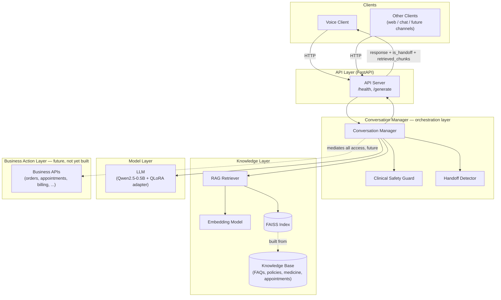
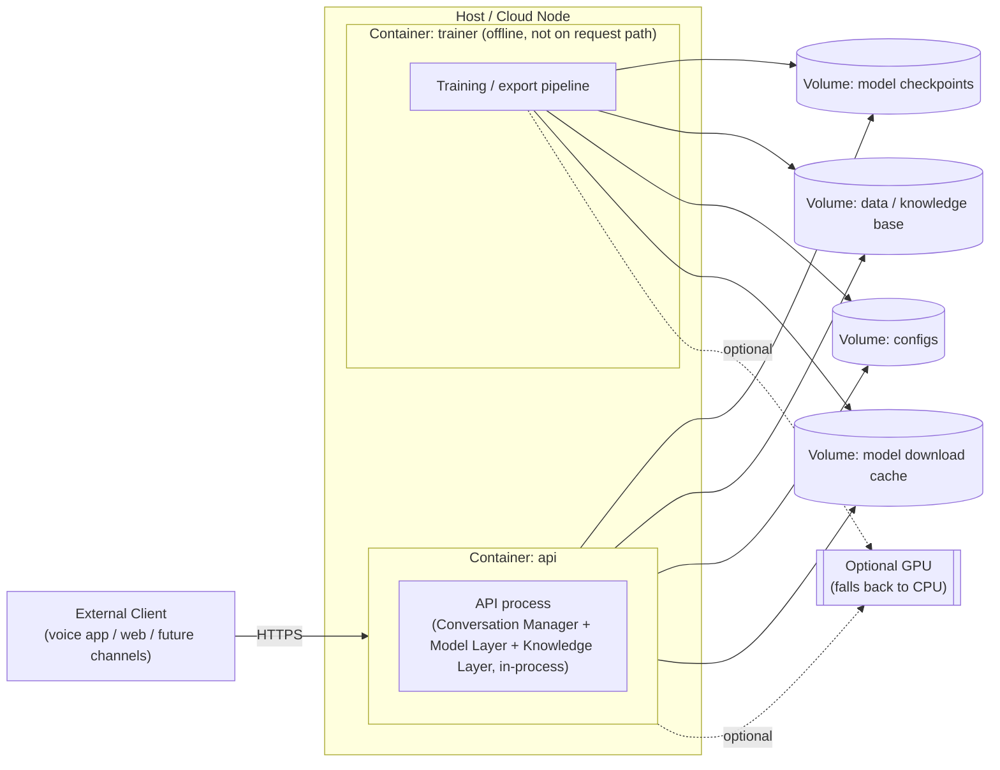

# Architecture

This document describes the architecture of the AI Employee Platform: a voice-first customer support agent built on a small fine-tuned LLM, grounded by retrieval, and hardened with deterministic safety layers. It is written for engineers joining or extending the platform.

**Scope note:** this document describes both what exists today and the target architecture for components that are currently logical rather than physical — notably the Conversation Manager (Section 5). Where current implementation and target architecture differ, that is called out explicitly. This document does not itself change, refactor, or implement any code.

## 1. System Overview

The platform answers customer questions over voice and text, grounding its answers in a retrieval-augmented knowledge base, and escalating to a human whenever it either decides to (semantic handoff detection) or is required to for safety reasons (the clinical safety guard). The core loop for a single conversational turn is:

1. A client (voice app, web chat, or a future channel) sends the user's utterance and prior conversation history to the API layer.
2. The **Conversation Manager** orchestrates the turn: it checks whether the utterance requires an unconditional safety escalation, retrieves relevant knowledge, invokes the LLM to generate a response, and checks the LLM's output for handoff intent.
3. The API layer streams the response back to the client, along with structured metadata (handoff flag/confidence, retrieved sources, clinical-guard status).

The platform currently runs a single small model (Qwen2.5-0.5B, QLoRA fine-tuned) rather than a large general-purpose LLM. That choice shapes several of the design goals below — the model is fast and cheap to run, including on CPU, but has limited reasoning capacity, which is precisely why grounding (RAG) and deterministic safety layers (clinical guard, handoff detector) exist as separate, non-negotiable components rather than being left to the model's judgment.

## 2. Design Goals

| Goal | What it means here |
|---|---|
| **Safety over fluency** | A wrong but safe answer (escalate to a human) is always preferred over a fluent but unsafe or fabricated one. Safety-relevant decisions must not depend on model behavior alone. |
| **Groundedness** | Factual answers (policy, product, appointment information) come from retrieved knowledge, not from the model's parametric memory. |
| **Deterministic, testable safety logic** | Handoff detection and clinical escalation are rule-based and unit-testable, not left to LLM judgment calls that can't be regression-tested cheaply. |
| **Low resource footprint** | The platform must run acceptably on CPU-only hardware, not assume GPU availability. This bounds model size and pushes complexity into retrieval/rules rather than a bigger model. |
| **Evaluability** | Every material behavior change (detector logic, retrieval, prompts) must be measurable against a repeatable benchmark before being trusted. |
| **Extensibility without re-architecture** | New knowledge domains, new safety rules, and eventually new business actions should be addable via configuration and additive components, not structural rewrites. |
| **Auditability** | Every response should be traceable to what informed it: which knowledge chunks were retrieved, whether a safety guard fired, and why a handoff decision was made. |

## 3. Core Principles

These are architectural invariants — rules the system must hold regardless of which components get added later.

1. **The Conversation Manager is the orchestration layer.** All per-turn logic — safety checks, retrieval, generation, handoff detection, and (in the future) business actions — is coordinated by the Conversation Manager. No other component decides what happens next in a turn.
2. **The LLM never calls business APIs directly.** The LLM is a text-in, text-out component. It has no tool-calling ability, no network access, and no credentials. Any action that affects the outside world (booking an appointment, issuing a refund, looking up an order) is performed by the Conversation Manager or a component it explicitly invokes — never by the model itself.
3. **Safety checks are deterministic and run outside the model.** The Clinical Safety Guard and the Handoff Detector are rule-based components, not model calls. The model's job is to generate helpful text; it is never the sole authority on whether a conversation is safe to continue automatically.
4. **Retrieval precedes generation, not the reverse.** Knowledge is fetched and injected as context before the model generates; the model is not trusted to "look things up" mid-generation.
5. **Fail safe, not silent.** When a component can't do its job confidently (retrieval finds nothing relevant, the model's intent is ambiguous, a safety pattern matches), the system's default is to escalate to a human, not to guess.
6. **Configuration over code for tunable behavior.** Phrase lists, thresholds, and knowledge content live in config/data files, not hardcoded logic, so they can change without a code deployment.
7. **Every component is independently testable.** Retrieval, safety guards, and handoff detection must be verifiable in isolation, without requiring a full model load, so regressions are caught cheaply and fast.

## 4. High-Level Component Diagram (Mermaid)



**Note on the diagram:** there is intentionally no edge from the LLM to the Business Action Layer, the Knowledge Layer, or any client. The LLM only ever receives a prompt from, and returns text to, the Conversation Manager — see Section 6.

## 5. Component Responsibilities

| Component | Responsibility | Current implementation status |
|---|---|---|
| **Clients** (voice, web, future channels) | Capture user input, play back / render responses. Never talk to anything but the API layer. | Voice client implemented; other channels not yet built. |
| **API Layer** | Thin transport layer: HTTP request/response and streaming marshaling. No business or safety logic lives here. | Implemented (FastAPI: `/health`, `/generate`). |
| **Conversation Manager** | Single orchestration point for a turn: decides the order of safety checks, retrieval, generation, and post-generation checks; assembles the final response and its metadata. | **Logical component today, not a standalone module.** This sequence is currently implemented inline inside the inference component (Section 1 loop steps 2). Extracting it into a standalone module is a candidate future refactor, not performed by this document. |
| **Clinical Safety Guard** | Deterministically detects clinical/medical questions (dosage, interactions, diagnosis, etc.) and forces escalation *before* generation, so the model never improvises medical advice. | Implemented as a rule-based, YAML-configured detector, invoked by the orchestration logic prior to generation. |
| **Decision/Routing Layer** | Optimization only: after every safety/auth/policy check, labels the turn's route and may answer a short greeting/goodbye/thanks or verified-FAQ turn with fixed text instead of RAG → LLM. Never authoritative for safety, tools or identity. | Implemented (`src/agent/decision_router.py`, rule-based, no model/network) — see Section 12 and `docs/DECISION_ROUTING.md`. |
| **RAG Retriever** | Given a user utterance, returns the most relevant knowledge chunks and their similarity scores. Read-only against the knowledge layer. | Implemented (embedding-based similarity search over an indexed knowledge base). |
| **Embedding Model** | Converts text (knowledge chunks and queries) into vectors for similarity search. | Implemented (local embedding model, no external API dependency). |
| **Knowledge Base** | Source-of-truth content for FAQs, policies, medicine information, and appointment rules. | Implemented as structured data files, domain-separated. |
| **Vector Index** | Persisted, searchable index built from the Knowledge Base for fast retrieval. | Implemented (FAISS), rebuilt from the Knowledge Base when stale. |
| **LLM (Model Layer)** | Generates the natural-language response given a prompt (system instructions + retrieved context + conversation history + user turn). Pure text-in/text-out; no side effects. | Implemented (Qwen2.5-0.5B base model + QLoRA fine-tuning adapter). |
| **Handoff Detector** | Deterministically inspects the model's *output* for handoff/escalation intent, since the model itself decides in-band whether to offer a human handoff. | Implemented as a layered, YAML-configured, confidence-scored detector. |
| **Business Action Layer** | Performs real-world actions (order lookups, appointment changes, billing actions) on behalf of the Conversation Manager. | **Not yet built.** Included here to fix its place in the architecture ahead of implementation — see Section 10. |
| **Training Pipeline** | Offline: prepares data, fine-tunes the model, exports it for inference. Not part of the live request path. | Implemented as a batch pipeline, run independently of production traffic. |
| **Evaluation Harness** | Offline: runs a fixed benchmark against the live components (retrieval, handoff, clinical guard, latency) to catch regressions. | Implemented as a repeatable, scriptable benchmark suite. |

## 6. Communication Rules

These rules are binding, not suggestions — they are what keeps the Conversation Manager the single orchestration point and keeps the LLM incapable of independently reaching business systems.

1. **Clients talk only to the API layer**, over HTTP. No client ever calls the Conversation Manager, the LLM, the retriever, or any business API directly.
2. **The API layer talks only to the Conversation Manager.** It performs no retrieval, safety-check, or generation logic itself — it is a transport boundary.
3. **The Conversation Manager is the only caller of the Clinical Safety Guard, the RAG Retriever, the LLM, and the Handoff Detector for a given turn.** These components do not call each other directly, and they do not call back into the API layer or the client.
4. **The Clinical Safety Guard runs before generation** and can short-circuit the turn entirely (the Conversation Manager skips calling the LLM if the guard fires). **The Handoff Detector runs after generation**, against the LLM's output.
5. **The LLM has no outbound access of any kind.** It receives a prompt and returns text. It cannot call the retriever, the safety guard, another instance of itself, or any business API. All context it needs is assembled and handed to it by the Conversation Manager beforehand.
6. **The RAG Retriever is read-only** against the Knowledge Base and Vector Index. It never writes to them, and it never calls the LLM.
7. **Any future Business Action Layer is reachable only from the Conversation Manager.** The LLM must never be granted credentials, network access, or tool-calling ability that would let it reach a business API directly — even indirectly through a "suggested action" the model executes itself. If the model's output implies an action should be taken, deciding whether and how to take it is the Conversation Manager's responsibility, not the model's.
8. **The Training Pipeline and Evaluation Harness are offline processes.** They may read the Knowledge Base and produce/consume model artifacts, but they have no path into live production traffic and are not part of the request/response cycle above.

## 7. Deployment View



Today the API container runs the Conversation Manager's orchestration logic, the Model Layer, and the Knowledge Layer in a single process, backed by mounted volumes for the model checkpoint, knowledge base, and configuration. The training/export pipeline runs as a separate, offline container profile that never receives live traffic. GPU is optional at every stage — every component has a CPU fallback path, consistent with the low resource footprint design goal.

## 8. Scalability Strategy

- **Stateless API layer:** conversation history is passed by the caller on every request rather than held in server-side session state, so API instances can be scaled horizontally behind a load balancer without sticky sessions or shared session storage.
- **Read-mostly knowledge layer:** the vector index is rebuilt offline (or on the rare occasion the knowledge base changes) and is otherwise read-only at request time, so it can be replicated across instances or memory-mapped without write-contention concerns.
- **Small model footprint as a scaling lever:** because the model is intentionally small, the primary near-term scaling strategy is running more replicas of the same process, not sharding a single large model — this keeps horizontal scaling simple.
- **Latency-bound, not throughput-bound, today:** current per-turn latency is dominated by generation on CPU. Before adding replicas, the cheaper wins are GPU/quantized inference and shorter generations; replica count should scale with concurrent-conversation volume once single-turn latency is acceptable.
- **Retrieval and embedding as a future extraction point:** if the knowledge base grows substantially or multiple model instances need to share one index, the embedding + retrieval step is a natural candidate to split into its own internal service rather than being loaded in-process by every API replica.
- **Safety/handoff detection is cheap and local:** both are lightweight, rule-based, and require no network calls, so they add negligible overhead as request volume grows and do not need independent scaling.

## 9. Security Considerations

- **No hardcoded secrets:** credentials (e.g., third-party API keys) are read from environment variables, never committed to source control.
- **Model weights and generated artifacts are excluded from version control**, limiting accidental exposure of proprietary/fine-tuned model data through the repository.
- **The Clinical Safety Guard is a security-relevant control, not just a UX feature:** it exists specifically to prevent the model from being the sole gate on medically sensitive output, and its rules must be reviewed with the same rigor as any other safety-critical logic.
- **Retrieved content is treated as data, not instructions:** knowledge chunks are injected into the prompt as reference context for the model to draw from, not as commands — the Conversation Manager, not the model's interpretation of retrieved text, remains the authority on what happens next in a turn (see Core Principles).
- **No authentication/authorization is currently implemented on the API layer** — this is a known gap for any production/multi-tenant deployment and should be addressed before the API is exposed beyond a trusted network. Tracked in Section 10.
- **No transport security is implemented at the application layer today**; TLS termination is assumed to be handled by infrastructure in front of the API (reverse proxy / load balancer) in any real deployment.
- **Knowledge base content is a trust boundary:** since retrieved facts are presented to customers with implicit authority (especially in the medicine domain), changes to knowledge base content should go through the same review discipline as code changes, not be treated as "just data."
- **No customer PII/PHI is persisted by the platform today** (history is caller-supplied per request, not stored server-side); any future addition of persistent conversation storage must revisit this section.

## 10. Future Expansion

- **Extract the Conversation Manager into a standalone module**, formalizing the orchestration sequence that today lives inline in the inference component, so it can be tested, versioned, and extended independently of the model-loading code around it.
- **Build the Business Action Layer**, mediated exclusively by the Conversation Manager, to support real actions (order status, appointment changes, billing lookups) rather than the current retrieval-only, informational scope.
- **Add authentication/authorization** to the API layer ahead of any production or multi-tenant exposure.
- **Add observability**: structured tracing of a turn across the Conversation Manager's steps (safety check → retrieval → generation → handoff check), plus metrics/dashboards, beyond today's offline evaluation harness.
- **Introduce a persistent session/history store** if server-side conversation state becomes necessary, with an explicit data-retention policy (see `docs/DATABASE.md`).
- **Support additional knowledge domains and languages** by extending the existing config-driven knowledge base and detector pattern, rather than new bespoke logic per domain.
- **Evaluate swapping in a larger or differently-quantized model** via the existing export pipeline, if accuracy needs outgrow the current small-model + heavy-grounding approach.
- **Move to streaming, bidirectional transport (e.g., WebSockets)** for the voice channel if request/response latency becomes a limiting factor for conversational feel.
- **A/B testing / experimentation framework** for prompts, retrieval tuning, and detector thresholds, built on top of the existing evaluation harness rather than replacing it.

## 11. Distributed Tracing (Phase 14)

**Note:** the rest of this document (Sections 1-10) predates the Policy Engine, Tool Orchestrator, Session/Memory persistence, and telephony/voice layers added in later phases and describes the pre-Phase-3 system shape; it has not been rewritten here. This section documents only what Phase 14 (`src/agent/tracing.py`) added: OpenTelemetry distributed tracing across the turn-orchestration pipeline described in `PHASE_14_TELEMETRY_TRACING_REPORT.md`.

### Span hierarchy

Every `/generate` turn and tool invocation produces a tree of spans sharing one `trace_id`:

```
conversation.handle_turn                      (root — one per turn)
├── conversation.clinical_safety_check         (only when a clinical_guard is configured)
├── conversation.intent_classify
├── conversation.policy_evaluate
├── conversation.rag_retrieve                  (only when a retriever is configured)
├── conversation.llm_generate
│   └── tool_orchestrator.invoke               (only on a tool-routed turn; see below)
└── conversation.handoff_detect

tool_orchestrator.invoke                       (root of the tool-orchestrator's own gate sequence)
├── tool_orchestrator.gate_policy
├── tool_orchestrator.gate_authorization
├── tool_orchestrator.gate_privacy              (only when a privacy_service is configured)
├── tool_orchestrator.gate_confirmation
├── tool_orchestrator.gate_idempotency
└── tool_orchestrator.execute
```

A tool-routed turn short-circuits before `conversation.rag_retrieve`/`conversation.llm_generate` (Section 6's Communication Rule 2.6 in `conversation_manager.py`), so `tool_orchestrator.invoke` appears as a child of `conversation.handle_turn` directly, not nested under `conversation.llm_generate` — the diagram above shows it there only to indicate it is the same gate sequence `tests/test_tracing_pipeline.py::TestToolActionSpan` exercises independently. Every gate's early-return (deny) short-circuits the remaining gates and `execute`, exactly like the pre-Phase-14 control flow it observes (see `docs/TRACING.md` for the full span/attribute reference).

### Privacy guarantees

Span attributes are restricted to a fixed allow-list (`tracing.SpanAttributes`) — identifiers, categorical outcomes, counts, and latencies only. Raw user input, LLM output text, retrieved chunk content, auth tokens, and connection strings are never attached to a span. `tests/test_tracing_pipeline.py::test_span_attributes_never_contain_user_message` asserts this for a full turn.

### Correlation with logs and audit events

`AuditEvent` (`observability_models.py`) carries `trace_id`/`span_id`, populated by `AuditLogger.record()` from the active span at record time (`audit.py`). `StructuredJSONFormatter` (`src/voice/production_logging.py`) does the same for JSON log lines when `LOG_FORMAT=json`. All three (spans, audit events, logs) for one turn therefore share a single `trace_id` — see `tests/test_tracing_correlation.py`.

### Configuration and enablement

Tracing is disabled by default (`TRACING_ENABLED=false`) and is a strictly additive, fire-and-forget observer: a tracer failure of any kind (including the SDK itself misbehaving) degrades to a no-op rather than affecting the turn (`tracing.py`'s `_SafeTracer`; `tests/test_tracing_pipeline.py::test_tracing_error_does_not_break_turn`). See `docs/TRACING.md` for the full configuration reference and how to view traces locally with Jaeger.

## 12. Decision/Routing Layer

```text
Decision/Routing Layer

Purpose:          Reduce unnecessary LLM calls, latency, and cost.
Inputs:           Validated user turn + existing conversation context.
Outputs:          Structured route decision.
Authority:        Optimization only.
Safety authority: Existing clinical/auth/permission layers.
Fallback:         Existing safe conversation path.
```

Runs inside `ConversationManager.handle_turn()` after the clinical guard, session/ownership/pending-confirmation checks, IntentEngine and PolicyEngine, and before the clarification / tool / RAG → LLM branches. Routes: `SAFETY`, `CLARIFICATION`, `TOOL`, `DETERMINISTIC`, `CACHE`, `RAG`, `LLM`, `FALLBACK`. **Only `DETERMINISTIC` (fixed greeting/goodbye/thanks templates) and `CACHE` (verbatim knowledge-base FAQ answers; off in the shipped config, `faqs: []`, until the owner verifies the FAQ content) bypass LLM generation**, and only when the clinical guard scored exactly 0, policy is `ALLOW`, intent is `UNKNOWN`/`FAQ` on the `RAG_LLM` route, and no workflow is pending; `handle_turn()` re-checks those conditions itself. All other routes are labels: the existing branches act on their own conditions and never read the decision. Any router failure takes the existing path. Full routing table, failure matrix, metrics and security review: `docs/DECISION_ROUTING.md`.
