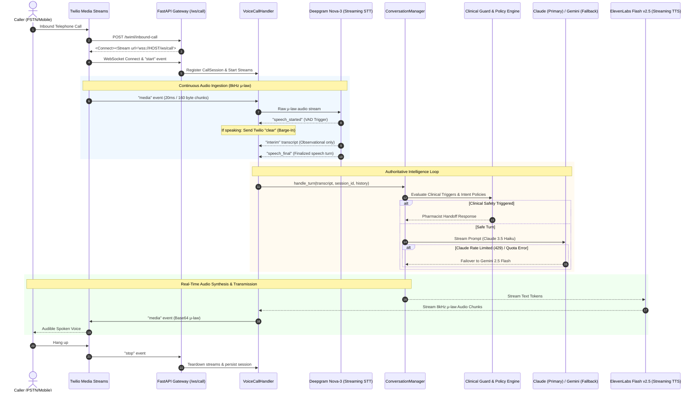

# Canary Telephony Deployment Architecture & Operations Guide

## 1. Architecture Overview

The system delivers a real-time, full-duplex telephony voice assistant designed for production clinical and general customer support inquiries.



---

## 2. Environment Variables Specification

All configuration is environment-driven. Secrets must never be committed to source control.

| Variable Name | Type | Required in Canary | Default | Description |
| :--- | :--- | :---: | :--- | :--- |
| `PORT` | Integer | No | `8000` | HTTP/WebSocket listener port |
| `LOG_LEVEL` | String | No | `INFO` | Standard logger severity (`DEBUG`, `INFO`, `WARNING`, `ERROR`) |
| `LOG_FORMAT` | String | **Yes** | `json` | Set to `json` for structured telemetry output |
| `LLM_PROVIDER` | String | **Yes** | `fallback` | LLM router (`fallback`, `claude`, `gemini`, `local`) |
| `ANTHROPIC_API_KEY` | Secret | **Yes** | None | Primary LLM API key |
| `ANTHROPIC_MODEL` | String | No | `claude-3-5-haiku-latest` | Lowest-latency model recommended for telephony |
| `GEMINI_API_KEY` | Secret | **Yes** | None | Fallback LLM API key |
| `GEMINI_MODEL` | String | No | `gemini-2.5-flash` | Automatic fallback provider model |
| `AUTH_MODE` | String | **Yes** | `production` | Production auth mode (`production` or `oidc`) |
| `DEV_AUTH_ENABLED` | Boolean | **Yes** | `false` | Must be `false` in canary to disable dev provider |
| `OIDC_ISSUER_URL` | URL | **Yes** | None | Trusted JWT issuer (e.g. `https://accounts.google.com`) |
| `OIDC_AUDIENCE` | String | **Yes** | None | Trusted client ID / audience |
| `OIDC_JWKS_URL` | URL | **Yes** | None | Public keys URL for JWT verification |
| `PERSISTENCE_MODE` | String | **Yes** | `production` | Persistence mode (`production` uses PostgreSQL) |
| `DATABASE_URL` | URL | **Yes** | None | PostgreSQL connection string |
| `DEEPGRAM_API_KEY` | Secret | **Yes** | None | Deepgram streaming STT API key |
| `DEEPGRAM_MODEL` | String | No | `nova-3` | STT model (`nova-3` recommended for telephony μ-law) |
| `ELEVENLABS_API_KEY` | Secret | **Yes** | None | ElevenLabs streaming TTS API key |
| `ELEVENLABS_VOICE_ID` | String | No | `21m00Tcm4TlvDq8ikWAM` | Telephony voice persona (e.g., Rachel) |
| `ELEVENLABS_MODEL_ID` | String | No | `eleven_flash_v2_5` | Low-latency flash synthesis model |
| `TWILIO_ACCOUNT_SID` | String | **Yes** | None | Twilio account identifier |
| `TWILIO_AUTH_TOKEN` | Secret | **Yes** | None | Twilio auth token for webhook validation |
| `TWILIO_MEDIA_STREAM_URL` | URL | No | Dynamic | Public WebSocket URL (e.g. `wss://canary.domain.com/ws/call`) |
| `VOICE_PUBLIC_URL` | URL | No | Dynamic | Public HTTPS URL (e.g. `https://canary.domain.com`) |
| `VOICE_MOCK_SERVICES` | Boolean | No | `false` | Set to `false` for live canary; `true` for offline test suites |

---

## 3. Twilio Webhook Configuration

1. **Inbound Voice Webhook**:
   - In the Twilio Console under **Phone Numbers > Active Numbers > [Canary Number]**:
   - Set **"A CALL COMES IN"** to:
     `HTTP POST` -> `https://<CANARY_PUBLIC_HOST>/twiml/inbound-call`
2. **Status Callback URL**:
   - Set Status Callback to:
     `HTTP POST` -> `https://<CANARY_PUBLIC_HOST>/twiml/status` (optional)
3. **Media Streams Behavior**:
   - The `/twiml/inbound-call` endpoint automatically returns:
     ```xml
     <?xml version="1.0" encoding="UTF-8"?>
     <Response>
         <Connect>
             <Stream url="wss://<CANARY_PUBLIC_HOST>/ws/call">
                 <Parameter name="inboundTime" value="..." />
             </Stream>
         </Connect>
     </Response>
     ```
   - Twilio will open a persistent, bi-directional WebSocket connection with single-channel 8kHz G.711 μ-law audio.

---

## 4. WebSocket Protocol Lifecycle

1. `connected`: Handshake acknowledgement between Twilio and FastAPI.
2. `start`: Carries `callSid`, `streamSid`, and custom parameters (`sessionId`, `userId`). STT streaming session initializes.
3. `media`:
   - Inbound: 20ms base64-encoded audio frames forwarded directly to Deepgram without transcoding.
   - Outbound: 8kHz μ-law chunks generated by ElevenLabs base64-encoded and sent to Twilio.
4. `clear`: Sent by the agent to Twilio to flush the phone speaker buffer upon user barge-in.
5. `mark`: Sent at the end of every utterance to track when audio finishes playing on the caller's phone.
6. `stop`: Twilio closes the media stream upon call termination; all tasks and sockets are cleanly torn down.

---

## 5. Claude → Gemini Failover Architecture

The system implements `FallbackLLMProvider` which handles resilience transparently:
- **Primary**: Anthropic Claude 3.5 Haiku.
- **Fallback**: Google Gemini 2.5 Flash.
- **Trigger**: Any HTTP 429 (Rate Limit / Quota Exceeded), HTTP 529 (Overloaded), or connection failure before streaming begins.
- **Failover Behavior**:
  1. Catches provider error before any tokens are yielded to the client.
  2. Records an audit event (`RETRY_ATTEMPT`, outcome `failover`).
  3. Increments `llm_failover_events_total` metric.
  4. Puts primary provider in a 60-second cooldown window.
  5. Routes current turn and subsequent turns during cooldown directly to Gemini.
  6. Caller experiences no dropped calls, duplicate actions, or duplicate spoken sentences.