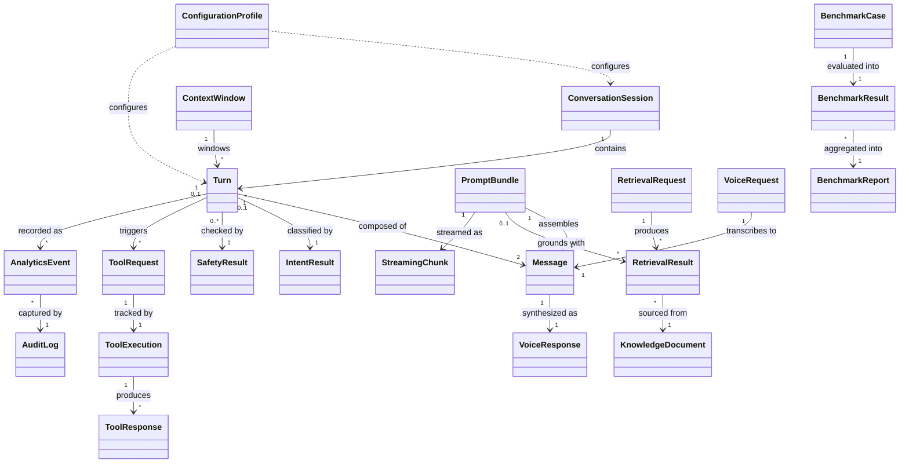
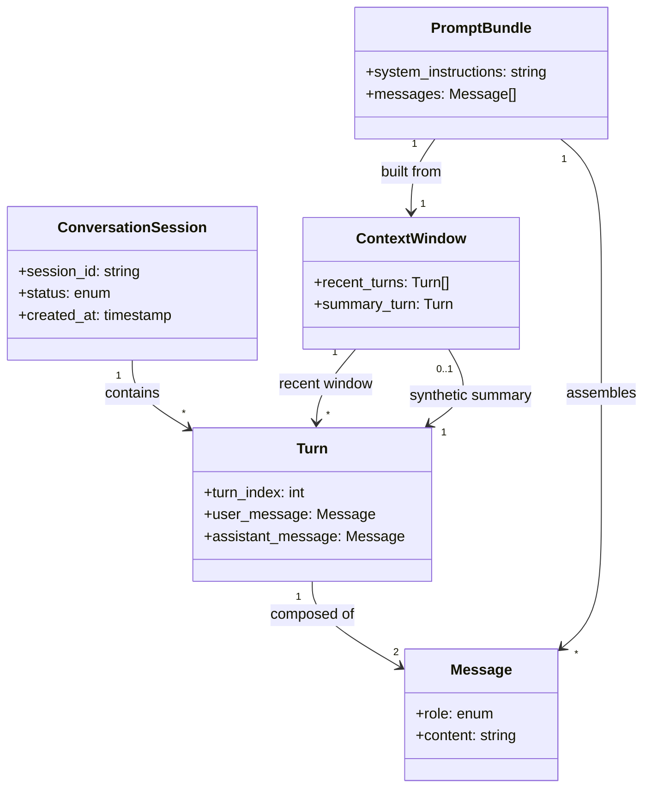
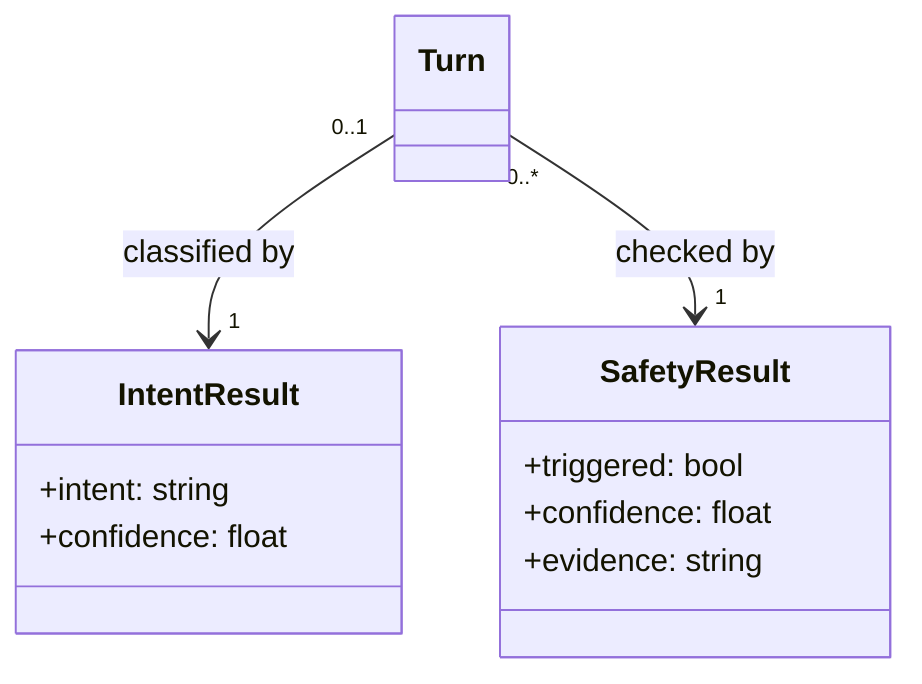
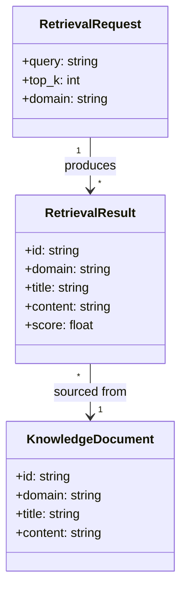
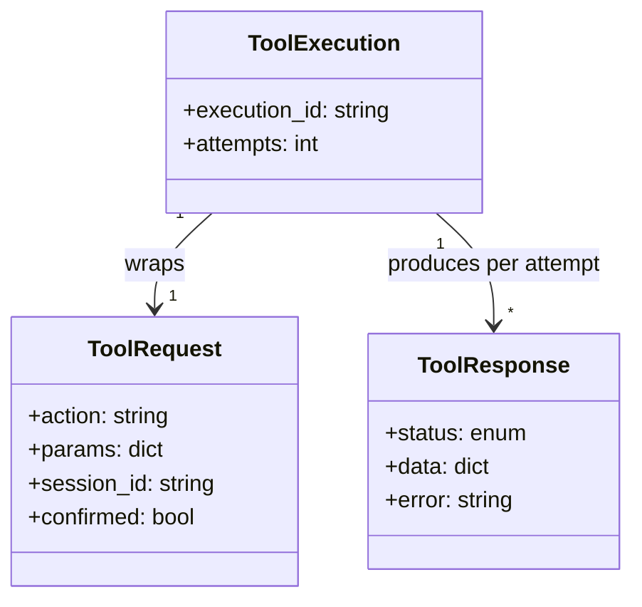
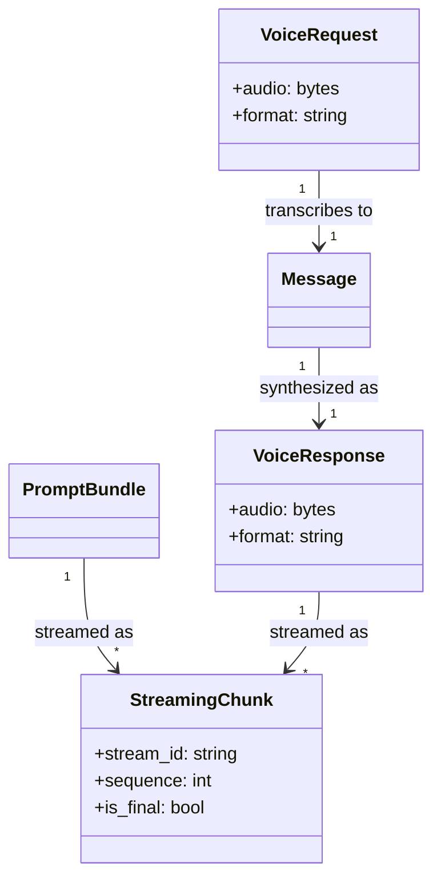
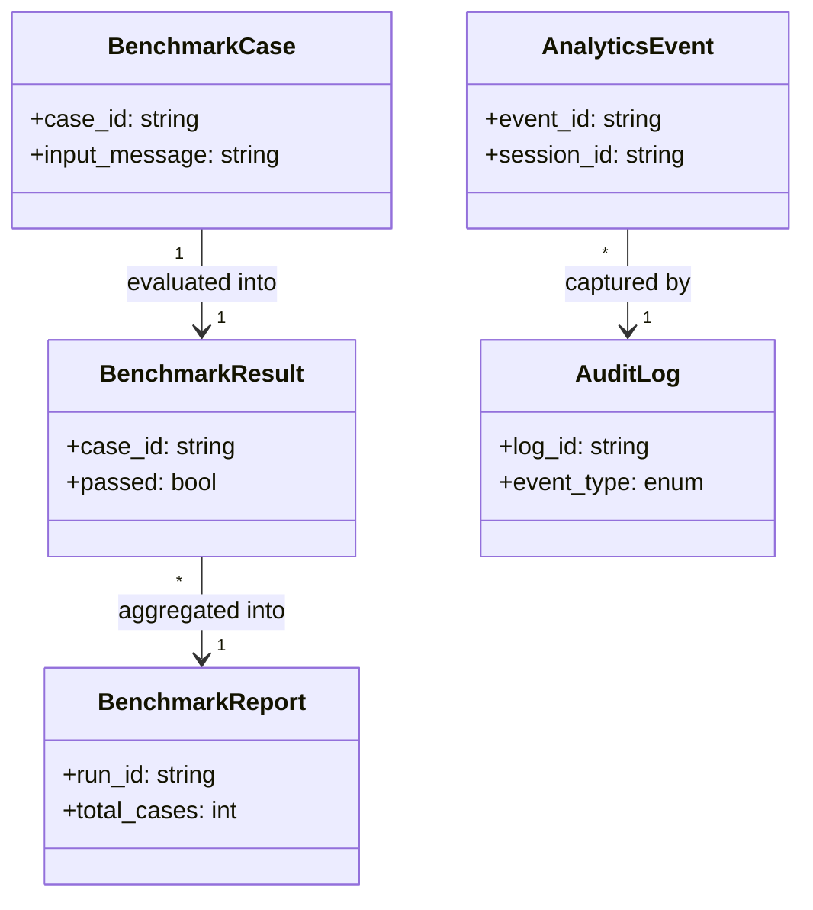

# Domain Model

**Status:** Frozen
**Version:** 1.0
**Date:** 2026-08-04

**Targets:** `docs/ARCHITECTURE.md` and `docs/MODULES.md` v1.0 (Frozen), `docs/SEQUENCE_DIAGRAMS.md` v1.0 (Frozen)

## Purpose & Scope

This document defines every shared domain entity used across the platform: what it means, which module owns it, how it's created and retired, what must always be true about it, how it relates to every other entity, and its field-level contract. It is documentation only — no implementation classes, no code, no changes to `ARCHITECTURE.md` or `MODULES.md`, and no new modules. Every "Owner Module" assigned below is one of the 12 modules already defined in `MODULES.md` v1.0.

This document does not restate `ARCHITECTURE.md`, `MODULES.md`, or `SEQUENCE_DIAGRAMS.md` — every module responsibility or interface claim is a pointer (`§N`) into `MODULES.md`, not a re-derivation. Where a field or entity closes a previously-identified gap (from `MODULES_REVIEW.md` or `SEQUENCE_DIAGRAMS.md`'s Inputs for Version 1.1), that's noted inline and rolled up in Appendix B.

## Global Versioning Convention

Rather than repeat a versioning policy in all 21 entities, one rule applies platform-wide: **entities version additively within v1.0** — new optional fields may be added without a version bump; removing or repurposing a field, or changing a required field's type, requires a new major entity version and an explicit migration note in this document. Each entity's "Versioning Strategy" subsection states whether it follows this convention as-is or has an entity-specific exception.

## Naming Cross-Reference

Some entities requested for this document use a different name than the interface type `MODULES.md` v1.0 already defines. This table maps them explicitly — it does not rename anything in the frozen interfaces, it gives the domain-level canonical name a pointer back to the exact interface it corresponds to.

| This document | MODULES v1.0 interface name |
|---|---|
| `SafetyResult` | `SafetyMatch` (§5) |
| `ToolRequest` | `ActionRequest` (§8) |
| `ToolResponse` | `ActionResult` (§8) |
| `AnalyticsEvent` | `TurnEvent` (§9) |
| `RetrievalResult` | one `RetrievedChunk` (§6) |
| `VoiceRequest` | wraps `AudioStream` (§10 input) |
| `VoiceResponse` | wraps `AudioStream`/`AudioChunk` (§11 output) |

## Entity Relationship Overview

A high-level map of all 21 entities. This is intentionally field-free — see each group's dedicated diagram below for attributes and full cardinality.

---

## Group 1 — Conversation & Messaging

*Owner: Conversation Manager (§2), except `ConversationSession` and `ContextWindow`, owned by Memory (§4).*

**Terminology clarification:** `MODULES.md` §4's `append(session_id, user_turn: Turn, assistant_turn: Turn)` signature uses the name `Turn` for both parameters. This document resolves that generically-reused name precisely: a `Turn` (below) is the paired exchange itself, matching §4's own prose ("persist one completed turn"); each of `append()`'s two `Turn`-typed parameters is, in this model, a `Message`. This is a terminology clarification, not a change to the frozen §4 signature.

### ConversationSession

**Purpose:** The identity and lifecycle container for one ongoing conversation — what `session_id` refers to everywhere it appears in `MODULES.md`.

**Owner Module:** Memory (§4).

**Lifecycle:** Created on first turn of a new `session_id`. Remains `active` across turns. Transitions to `closed` on explicit end-of-conversation or retention-policy expiry (§4 future responsibility, `docs/DATABASE.md`). Never reopened once closed — a new session is created instead.

**State Invariants:**
- `session_id` is immutable once assigned.
- Status transitions only move forward: `active → closed`, never the reverse.
- A session with no `Turn`s is valid (freshly created) but has an empty `ContextWindow`.

**Relationships:**
- 1 `ConversationSession` → * `Turn` (one session, many turns, ordered by `turn_index`).
- 1 `ConversationSession` → 1 `ContextWindow` (the session's current windowed view).

**Required Fields:**

| Field | Type | Description |
|---|---|---|
| `session_id` | string | Unique identifier, caller- or platform-assigned |
| `status` | enum(`active`, `closed`) | Current lifecycle state |
| `created_at` | timestamp | Session creation time |

**Optional Fields:**

| Field | Type | Description |
|---|---|---|
| `user_id` | string | External identity reference, if authentication exists (not yet in scope per `ARCHITECTURE.md` §9) |
| `last_activity_at` | timestamp | Updated on each turn; drives retention expiry |
| `retention_expires_at` | timestamp | Per §4's future retention policy |

**Validation Rules:**
- `session_id` must be non-empty and unique at creation time.
- `status` must be one of the two defined enum values — no other state is valid.

**Serialization Rules:**
- Never serialized with its full `Turn` history inline by default — `Turn`s are addressed by `session_id` + `turn_index`, not embedded, to avoid unbounded payload growth (the same concern §4's summarization strategy exists to manage).
- `user_id`, if present, is treated as sensitive and excluded from `AnalyticsEvent`/`AuditLog` serialization (see those entities).

**Versioning Strategy:** Follows the Global Versioning Convention. No entity-specific exception.

---

### Turn

**Purpose:** One completed conversational exchange — a user message paired with the assistant's response — the unit Memory persists and Conversation Manager assembles per turn.

**Owner Module:** Conversation Manager (§2) — assembled per turn; persisted by Memory (§4).

**Lifecycle:** Created by Conversation Manager once a turn completes (after generation, safety checks, and any tool execution). Immutable once created. Appended to its `ConversationSession` via `Memory.append()`. Never mutated after append — a correction is a new `Turn`, not an edit.

**State Invariants:**
- `turn_index` is strictly increasing within a session and never reused.
- A `Turn` always has exactly one `user_message` and one `assistant_message` — no partial turns are persisted (a failed generation still produces a `Turn`, using the fallback response text per §2 Error Handling, not an absent `assistant_message`).
- Once appended, a `Turn`'s content fields are read-only.

**Relationships:**
- 1 `Turn` → 2 `Message` (`user_message`, `assistant_message`).
- 1 `Turn` → 0..1 `IntentResult` (present once Intent Engine is implemented, §3).
- 1 `Turn` → 0..* `SafetyResult` (up to two: pre-generation clinical check, post-generation handoff check, §5).
- 1 `Turn` → 0..* `RetrievalResult` (grounding chunks used, if RAG Engine was invoked, §6).
- 1 `Turn` → 0..* `ToolRequest` (business actions triggered, if any, §8).
- 1 `Turn` → * `AnalyticsEvent` (recorded observations about this turn, §9).

**Required Fields:**

| Field | Type | Description |
|---|---|---|
| `turn_index` | int | Monotonic position within the session |
| `user_message` | Message | The user's input for this turn |
| `assistant_message` | Message | The assistant's response for this turn |
| `created_at` | timestamp | Turn completion time |

**Optional Fields:**

| Field | Type | Description |
|---|---|---|
| `intent` | IntentResult | Present once Intent Engine (§3) is implemented |
| `safety_results` | SafetyResult[] | Pre/post-generation check outcomes |
| `retrieved_context` | RetrievalResult[] | Grounding chunks used, if any |
| `latency_ms` | float | End-to-end turn latency |

**Validation Rules:**
- `turn_index` must be greater than every prior `turn_index` in the same session.
- `assistant_message.role` must be `assistant`; `user_message.role` must be `user` — role/field pairing is not interchangeable.

**Serialization Rules:**
- Serializes as a flat object with `user_message`/`assistant_message` embedded (not addressed by reference) — a `Turn` is small and self-contained enough to inline safely, unlike a `ConversationSession`'s full history.
- Optional fields (`intent`, `safety_results`, `retrieved_context`) are omitted, not null, when the producing module hasn't run (keeps payloads proportional to what actually executed that turn).

**Versioning Strategy:** Follows the Global Versioning Convention. Adding a new optional per-turn annotation (e.g. a future `tool_results` field once Tool Orchestrator ships) is additive and does not require a version bump.

---

### Message

**Purpose:** The atomic role/content unit — what a `Turn` is made of, what a `PromptBundle` is assembled from, and what streaming ultimately reconstructs into on the client.

**Owner Module:** Conversation Manager (§2).

**Lifecycle:** Created the instant content exists in a role — either from the Client (`user`), Conversation Manager (`system`, e.g. the system prompt or injected grounding context), or LLM Service's completed output (`assistant`). Immutable once created.

**State Invariants:**
- `role` is always one of a fixed, closed set — never a free-form string.
- `content` is never mutated after creation; a correction produces a new `Message` in a new `Turn`.
- A `system`-role `Message` never originates from the Client — only Conversation Manager constructs those (consistent with §1's "API Gateway carries no business or safety logic itself").

**Relationships:**
- 2 `Message` → 1 `Turn` (the pair a `Turn` is composed of).
- * `Message` → 1 `PromptBundle` (assembled in order: system, context, history, latest user).
- 1 `Message` (user, from a transcript) ← 1 `VoiceRequest` (§10).
- 1 `Message` (assistant) → 1 `VoiceResponse` (§11).

**Required Fields:**

| Field | Type | Description |
|---|---|---|
| `role` | enum(`user`, `assistant`, `system`) | Who/what produced this content |
| `content` | string | The message text |

**Optional Fields:**

| Field | Type | Description |
|---|---|---|
| `name` | string | Reserved for future multi-participant scenarios; unused in v1.0's single-user model |
| `metadata` | dict | Free-form, module-specific annotation (e.g. streaming source) |

**Validation Rules:**
- `content` must be non-empty for `user` and `assistant` roles; a `system` message may be programmatically empty only if no grounding context or system prompt applies (not expected in practice, since §2 always sets a system prompt).
- `role` must be one of the three defined values.

**Serialization Rules:**
- Serializes as `{role, content}` at minimum — matches the shape every LLM chat-template convention already expects, so no translation layer is needed between this entity and `PromptBundle` assembly.
- `metadata`, if present, is stripped before the `Message` is handed to LLM Service — per §7, LLM Service receives only what's needed to generate, nothing else.

**Versioning Strategy:** Follows the Global Versioning Convention. `role`'s enum is the one field where an addition (a new role) is treated as a breaking change requiring a major version bump, since every consumer switches on it exhaustively.

---

### PromptBundle

**Purpose:** The single, fully-assembled unit LLM Service accepts — per §7, "the LLM Service does not decide what goes into the prompt; that's the Conversation Manager's responsibility." This entity is that responsibility's output.

**Owner Module:** Conversation Manager (§2, §7 Inputs).

**Lifecycle:** Constructed fresh once per generation call — including Memory's summarization generation call (§4), which also routes through Conversation Manager → LLM Service using its own `PromptBundle`. Never persisted or reused across turns; discarded immediately after the corresponding `generate()`/`generate_stream()` call returns.

**State Invariants:**
- Treated as read-only once passed to LLM Service — §7 states LLM Service "does not decide what goes into the prompt," which implies it also never modifies what it's given.
- `messages` is always ordered: system instructions first, optional grounding context next, then history, then the current user turn last.
- Every `PromptBundle` corresponds to exactly one `generate()`/`generate_stream()` call — never batched across multiple calls.

**Relationships:**
- 1 `PromptBundle` → 1 `ContextWindow` (the history/summary it's built from).
- 1 `PromptBundle` → * `Message` (its assembled contents).
- 1 `PromptBundle` → 0..* `RetrievalResult` (grounding context, if RAG Engine was invoked, §6).
- 1 `PromptBundle` → * `StreamingChunk` (LLM Service's streamed output, §7).

**Required Fields:**

| Field | Type | Description |
|---|---|---|
| `system_instructions` | string | The system prompt (§2's `SYSTEM_PROMPT`-equivalent) |
| `messages` | Message[] | Ordered conversation content |
| `max_new_tokens` | int | Generation cap for this call |

**Optional Fields:**

| Field | Type | Description |
|---|---|---|
| `grounding_context` | RetrievalResult[] | Present only when RAG Engine was invoked for this turn |
| `generation_parameters` | dict | temperature/top_p/repetition_penalty, sourced from Config Service (§12a) |

**Validation Rules:**
- `messages` must contain at least one entry (the current user turn) — an empty `PromptBundle` is invalid.
- `max_new_tokens` must be a positive integer.

**Serialization Rules:**
- Not typically serialized across a network boundary — `PromptBundle` is an in-process contract between Conversation Manager and LLM Service (both are, per §2/§7, physically co-located today; see `MODULES.md` Known Implementation Debt). If/when they're split into separate services, this becomes the wire contract and should serialize as `{system_instructions, messages, max_new_tokens, generation_parameters}`.

**Versioning Strategy:** Follows the Global Versioning Convention. This entity closes a gap first flagged in `SEQUENCE_DIAGRAMS.md` Inputs for v1.1 (item M1) — see Appendix B.

---

### ContextWindow

**Purpose:** The bounded, composed view of a session's history that Memory hands back on `retrieve()` — the running summary plus the verbatim recent window, per §4's summarization/truncation strategy.

**Owner Module:** Memory (§4).

**Lifecycle:** Recomputed (not persisted as its own row) on every `Memory.retrieve()` call, from the session's stored `Turn`s and, if one exists, its running summary. Ephemeral — exists only for the duration of the retrieval call and the `PromptBundle` assembly that follows it.

**State Invariants:**
- `recent_turns` never exceeds the configured `keep_last_n` (Config Service `get_memory_config()`, §12a).
- If a `summary_turn` is present, it always precedes `recent_turns` in ordering — never interleaved.
- The turns collapsed into `summary_turn` are exactly the turns *not* present in `recent_turns` — no gap and no overlap.

**Relationships:**
- 1 `ContextWindow` → 1 `ConversationSession` (whose view this is).
- 1 `ContextWindow` → * `Turn` (the verbatim recent window).
- 1 `ContextWindow` → 0..1 `Turn` (the synthetic summary turn, per §4's exact phrasing).
- 1 `PromptBundle` ← 1 `ContextWindow` (consumed by).

**Required Fields:**

| Field | Type | Description |
|---|---|---|
| `session_id` | string | Which session this window is for |
| `recent_turns` | Turn[] | The verbatim, most-recent window |
| `window_size` | int | The `keep_last_n` value applied |

**Optional Fields:**

| Field | Type | Description |
|---|---|---|
| `summary_turn` | Turn | The synthetic running-summary turn, if summarization has occurred |
| `summarized_through_index` | int | The `turn_index` up to which the summary is current |

**Validation Rules:**
- `recent_turns.length` must be ≤ `window_size`.
- If `summarized_through_index` is present, it must be less than the smallest `turn_index` in `recent_turns` (no double-coverage).

**Serialization Rules:**
- Never serialized independently across a network boundary — it's an in-process composition Memory produces for Conversation Manager, discarded once the `PromptBundle` is built.

**Versioning Strategy:** Follows the Global Versioning Convention.

---

## Group 2 — Understanding & Safety

*Owner: Intent Engine (§3) for `IntentResult`; Safety Engine (§5) for `SafetyResult`.*

### IntentResult

**Purpose:** The classification Conversation Manager uses to decide which downstream modules a turn needs — exactly `MODULES.md` §3's `IntentResult`.

**Owner Module:** Intent Engine (§3).

**Lifecycle:** Produced once per turn by `Intent Engine.classify()`, consumed immediately by Conversation Manager to route the rest of the turn (grounding, tool invocation). Attached to the resulting `Turn` as an optional field; otherwise discarded.

**State Invariants:**
- `intent` is always one of the fixed, versioned taxonomy (§3) — never null and never a value outside the taxonomy; an unclassifiable input resolves to the taxonomy's broadest, safest category rather than an absent result (§3 Error Handling).
- `confidence` is always in `[0.0, 1.0]`.

**Relationships:**
- 1 `IntentResult` → 1 `Turn` (the turn it classifies).
- 1 `IntentResult` → 0..* `ToolRequest` (informs, per §8 Ownership — Conversation Manager uses the classification as signal, never as direct instruction).

**Required Fields:**

| Field | Type | Description |
|---|---|---|
| `intent` | string (enum, versioned taxonomy) | e.g. `knowledge_lookup`, `appointment_action`, `escalation_request`, `clinical_question`, `out_of_domain`, `chit_chat` |
| `confidence` | float | 0.0–1.0 |

**Optional Fields:** None — §3's interface defines exactly these two fields.

**Validation Rules:**
- `intent` must match a value in the currently-configured taxonomy (Config Service `get_intent_config()`, §12a).
- `confidence` must be within `[0.0, 1.0]`; out-of-range values are a producer bug, not a valid state.

**Serialization Rules:**
- Serializes as a flat `{intent, confidence}` object — no nesting.

**Versioning Strategy:** The taxonomy itself is versioned per §3 ("fixed, versioned intent taxonomy"); the `IntentResult` shape follows the Global Versioning Convention independently of taxonomy version changes.

---

### SafetyResult

**Purpose:** The deterministic decision Safety Engine returns from either check point — matches `MODULES.md` §5's `SafetyMatch`. One shape, reused for both `check_clinical()` (pre-generation) and `check_handoff()` (post-generation), per §5's documented shared-engine design.

**Owner Module:** Safety Engine (§5).

**Lifecycle:** Produced synchronously at each of the (up to two) check points in a turn. Not persisted independently — attached to the `Turn` it evaluated and to any `AnalyticsEvent`/`AuditLog` entries derived from it.

**State Invariants:**
- If `triggered` is `true`, `evidence` is always present (§5: "Surface which rule/layer/pattern matched, for auditability").
- `confidence` is always in `[0.0, 1.0]`.
- On an internal Safety Engine error, the result defaults to `triggered: true` — the one deliberate fail-closed exception in `MODULES.md` v1.0 (§5 Error Handling); a `SafetyResult` is never silently "not triggered" as a result of an internal failure.

**Relationships:**
- 1 `SafetyResult` → 1 `Turn` (the turn it evaluated — either the user's message, for `check_clinical`, or the assistant's message, for `check_handoff`).
- 1 `SafetyResult` → 0..* `AnalyticsEvent` (recorded, §9).
- 1 `SafetyResult` → 0..* `AuditLog` (captured, for auditability).

**Required Fields:**

| Field | Type | Description |
|---|---|---|
| `triggered` | bool | Whether this check fired |
| `confidence` | float | 0.0–1.0 |

**Optional Fields:**

| Field | Type | Description |
|---|---|---|
| `evidence` | string | Human-readable match evidence; present when `triggered` is `true` |
| `check_type` | enum(`clinical`, `handoff`) | Which of §5's two check points produced this result — an elaboration beyond §5's literal bracket notation, needed because one shape is reused for both checks and something must disambiguate which produced a given stored instance |

**Validation Rules:**
- `confidence` must be within `[0.0, 1.0]`.
- `evidence` must be non-empty whenever `triggered` is `true`.

**Serialization Rules:**
- Serializes as a flat object; `evidence` is omitted (not null) when `triggered` is `false`, to keep the common non-triggered case compact.

**Versioning Strategy:** Follows the Global Versioning Convention. `check_type` was added here specifically to disambiguate the two check points that share one wire shape — see the Naming Cross-Reference and §5's "Important internal note" on shared-engine coupling.

---

## Group 3 — Knowledge & Retrieval

*Owner: RAG Engine (§6).*

### RetrievalRequest

**Purpose:** The input contract to `RAG Engine.retrieve()` — formalizes §6's three call parameters (`query`, `top_k`, `domain`) as a named entity.

**Owner Module:** RAG Engine (§6).

**Lifecycle:** Constructed by Conversation Manager once per turn, only when Intent Engine's classification calls for grounding (§2 Responsibilities). Passed to RAG Engine and discarded after the call returns.

**State Invariants:**
- `top_k` is always a positive integer.
- `query` is never empty (an empty query is not a valid retrieval request; Conversation Manager doesn't invoke RAG Engine at all if there's nothing to ground).

**Relationships:**
- 1 `RetrievalRequest` → 1 `Turn` (the turn it was issued for).
- 1 `RetrievalRequest` → * `RetrievalResult` (its output).

**Required Fields:**

| Field | Type | Description |
|---|---|---|
| `query` | string | The text to retrieve grounding for |
| `top_k` | int | Maximum results to return |

**Optional Fields:**

| Field | Type | Description |
|---|---|---|
| `domain` | string | Optional domain filter (§6) |

**Validation Rules:**
- `query` must be non-empty after trimming.
- `top_k` must be > 0.

**Serialization Rules:**
- Serializes as a flat object; not persisted beyond the call it drives.

**Versioning Strategy:** Follows the Global Versioning Convention.

---

### RetrievalResult

**Purpose:** One scored chunk returned from retrieval — matches §6's `RetrievedChunk` exactly.

**Owner Module:** RAG Engine (§6).

**Lifecycle:** Produced by `RAG Engine.retrieve()`, one instance per returned chunk. Consumed by Conversation Manager for score-threshold filtering and `PromptBundle` assembly; may also be attached to the resulting `Turn` and `AnalyticsEvent` for retrieval-hit-rate reporting (§9).

**State Invariants:**
- `score` values within one `RetrievalRequest`'s result set are comparably ranked (higher is more relevant) — comparing scores *across* different requests is not meaningful, since embedding/index state may differ between them.
- Never returned with `content` empty — an empty-content chunk is not a valid retrieval result.

**Relationships:**
- * `RetrievalResult` → 1 `RetrievalRequest` (which call produced it).
- * `RetrievalResult` → 1 `KnowledgeDocument` (its source).
- 0..* `RetrievalResult` → 1 `Turn` (attached, if this turn used grounding).
- 0..* `RetrievalResult` → 1 `PromptBundle` (included as grounding context).

**Required Fields:**

| Field | Type | Description |
|---|---|---|
| `id` | string | Source chunk identifier |
| `domain` | string | Which knowledge domain it belongs to |
| `title` | string | Short label |
| `content` | string | The chunk text |
| `score` | float | Similarity score |

**Optional Fields:**

| Field | Type | Description |
|---|---|---|
| `tags` | string[] | Present if the source `KnowledgeDocument` defines them — an elaboration beyond §6's literal bracket notation |

**Validation Rules:**
- `id` must reference an existing `KnowledgeDocument`.
- `score` must be a finite number (no NaN/undefined).

**Serialization Rules:**
- Serializes flat; `score` is typically rounded to a fixed precision for display/logging (matches the pattern already used for `RetrievedChunk.to_dict()`'s rounding).

**Versioning Strategy:** Follows the Global Versioning Convention.

---

### KnowledgeDocument

**Purpose:** The source content RAG Engine indexes and retrieves from — per §6's naming cross-reference, "data, not a module," but still a first-class domain entity with its own contract.

**Owner Module:** RAG Engine (§6) — the module responsible for reading, embedding, and indexing this content, even though the content itself is authored outside the platform's runtime module graph.

**Lifecycle:** Authored/maintained outside the request path (an offline content-authoring process, per §6's "should go through the same review discipline as code changes," `ARCHITECTURE_REVIEW.md` 5.3). Read by RAG Engine at index-build time; re-read whenever the index is rebuilt (§6 Error Handling — self-heal on staleness).

**State Invariants:**
- `id` is unique within the knowledge base as a whole (not just within one domain) — retrieval results reference it directly and ambiguity would break that reference.
- `content` is never empty.

**Relationships:**
- 1 `KnowledgeDocument` → * `RetrievalResult` (every retrieval hit sourced from it, across all requests over time).

**Required Fields:**

| Field | Type | Description |
|---|---|---|
| `id` | string | Unique identifier |
| `domain` | string | Knowledge domain (derived from source file, per `src/rag/knowledge_base.py`'s pattern of one domain per file — noted for continuity, not as an implementation dependency) |
| `title` | string | Short label |
| `content` | string | Full document/chunk text |

**Optional Fields:**

| Field | Type | Description |
|---|---|---|
| `tags` | string[] | Free-form categorization |
| `source_updated_at` | timestamp | Drives RAG Engine's staleness check (§6) |

**Validation Rules:**
- `id` must be unique platform-wide.
- `domain` must be non-empty.

**Serialization Rules:**
- Persisted as source-of-truth content (file-based today, per §6); indexed representations (embeddings) are a derived artifact of this entity, not a separate domain entity in this document.

**Versioning Strategy:** Content changes are not versioned at the entity-schema level (that's a content-authoring/review-process concern, §6) — only the *shape* of `KnowledgeDocument` itself follows the Global Versioning Convention.

---

## Group 4 — Tool Execution

*Owner: Tool Orchestrator (§8).*

### ToolRequest

**Purpose:** The only shape Tool Orchestrator ever accepts as an executable instruction — matches §8's `ActionRequest` exactly. Never raw LLM output.

**Owner Module:** Tool Orchestrator (§8).

**Lifecycle:** Constructed by Conversation Manager, using `IntentResult` and the LLM's response as signal — never as direct instruction (§8 Ownership). Passed to `Tool Orchestrator.invoke()`. May be constructed twice for one logical action if a `confirmation_required` response comes back — the second instance has `confirmed: true`.

**State Invariants:**
- `confirmed` must be `true` if the referenced action's `ActionSpec.requires_confirmation` is `true` — otherwise Tool Orchestrator rejects it (§8).
- `action` always matches a name from `Tool Orchestrator.list_actions()` — never an arbitrary string.
- Only ever constructed by Conversation Manager (§8 Ownership) — no other module builds one.

**Relationships:**
- 1 `ToolRequest` → 1 `ToolExecution` (the tracking record for its attempts).
- 1 `ToolRequest` → 1 `Turn` (the turn it originated within).
- 1 `ToolRequest` ← 1 `IntentResult` (informed by).

**Required Fields:**

| Field | Type | Description |
|---|---|---|
| `action` | string | Must match a registered `ActionSpec.name` |
| `params` | dict | Must satisfy that action's `params_schema` |
| `session_id` | string | The conversation this action belongs to |

**Optional Fields:**

| Field | Type | Description |
|---|---|---|
| `confirmed` | bool | Defaults to `false` per §8 |

**Validation Rules:**
- `action` must exist in the current `list_actions()` catalog.
- `params` must validate against the action's declared `params_schema` before `invoke()` proceeds.

**Serialization Rules:**
- Serializes flat; `params` is an opaque dict from this entity's perspective — its internal shape is defined per-action by `ActionSpec.params_schema`, not by `ToolRequest` itself.

**Versioning Strategy:** Follows the Global Versioning Convention.

---

### ToolResponse

**Purpose:** What Tool Orchestrator returns for a given `ToolRequest` — matches §8's `ActionResult` exactly, including the `confirmation_required` status that makes the confirmation-gating contract explicit.

**Owner Module:** Tool Orchestrator (§8).

**Lifecycle:** Produced once per `invoke()` call (i.e., once per attempt, including retries). Returned to Conversation Manager, which decides retry/degrade/escalate on failure — Tool Orchestrator itself never escalates (§8 Error Handling).

**State Invariants:**
- `status: "confirmation_required"` only ever appears when the request's `confirmed` was `false` and the action requires confirmation — it is returned, never raised as an exception (§8).
- `data` is present only when `status` is `"success"`; `error` is present only when `status` is `"failure"`.

**Relationships:**
- * `ToolResponse` → 1 `ToolExecution` (one response per attempt, tracked there).
- 1 `ToolResponse` → 0..* `AnalyticsEvent` (recorded, once Tool Orchestrator is implemented).

**Required Fields:**

| Field | Type | Description |
|---|---|---|
| `status` | enum(`success`, `failure`, `confirmation_required`) | Outcome of this attempt |

**Optional Fields:**

| Field | Type | Description |
|---|---|---|
| `data` | dict | Present when `status` is `success` |
| `error` | string | Present when `status` is `failure` |

**Validation Rules:**
- Exactly one of `data`/`error` may be present, and only in the combination matching `status` (no `data` on failure, no `error` on success).

**Serialization Rules:**
- Serializes flat; `data`'s internal shape is opaque to this entity, defined per-action.

**Versioning Strategy:** Follows the Global Versioning Convention. Adding a fourth `status` value would be a breaking change (every consumer switches on it exhaustively per §8's contract) and requires a major version bump.

---

### ToolExecution

**Purpose:** The execution-tracking record wrapping one logical action across however many attempts Tool Orchestrator's internally-owned retry/timeout policy takes (§8) — new in this document; `MODULES.md` names the retry *responsibility* but not a record of it.

**Owner Module:** Tool Orchestrator (§8).

**Lifecycle:** Created when Conversation Manager first calls `invoke()` for a given logical action. Accumulates one `ToolResponse` per attempt as Tool Orchestrator retries internally. Closed once a terminal `ToolResponse` (`success` or `failure` after retries exhausted) is produced — a `confirmation_required` response does not close it; the same `execution_id` continues once the confirmed re-invocation arrives.

**State Invariants:**
- `attempts` only increases, never resets, for a given `execution_id`.
- Exactly one `ToolResponse` per attempt — never zero, never more than one per attempt.
- The number of attempts is bounded by Tool Orchestrator's internal policy; the exact bound is not specified in `MODULES.md` v1.0 (see Appendix B — this remains an open item, not resolved by this entity's existence).

**Relationships:**
- 1 `ToolExecution` → 1 `ToolRequest` (the logical request it tracks).
- 1 `ToolExecution` → * `ToolResponse` (one per attempt).

**Required Fields:**

| Field | Type | Description |
|---|---|---|
| `execution_id` | string | Unique identifier for this logical action's full attempt history |
| `tool_request` | ToolRequest | The request being tracked |
| `attempts` | int | Count of attempts so far, ≥ 1 |

**Optional Fields:**

| Field | Type | Description |
|---|---|---|
| `responses` | ToolResponse[] | Ordered list, one per attempt |
| `final_response` | ToolResponse | Set once the execution closes |
| `started_at` / `completed_at` | timestamp | Execution window |

**Validation Rules:**
- `attempts` must equal `responses.length` when both are present.
- `final_response`, if present, must be the last element of `responses`.

**Serialization Rules:**
- Serializes with `responses` inline for audit purposes — unlike `ConversationSession`'s `Turn` history, a `ToolExecution`'s attempt count is expected to be small (bounded by a retry policy), so inlining is safe.

**Versioning Strategy:** Follows the Global Versioning Convention. This entity is new relative to `MODULES.md`'s named interfaces — see Appendix B for its relationship to the open retry-policy question (`SEQUENCE_DIAGRAMS.md` item M3).

---

## Group 5 — Streaming & Voice

*Owner: Shared/Core §12b for `StreamingChunk`; Voice STT (§10) for `VoiceRequest`; Voice TTS (§11) for `VoiceResponse`.*

### StreamingChunk

**Purpose:** The generic streaming envelope reused across LLM Service's `generate_stream`, API Gateway's NDJSON relay, and Voice TTS's `synthesize_stream` — exactly the kind of shared cross-module shape §12b (Shared Utilities) already names as an extraction candidate ("a consistent Turn/Chunk/ActionResult shape").

**Owner Module:** Shared/Core → Shared Utilities (§12b).

**Lifecycle:** One instance per emitted unit within an active stream. Exists only for the duration of transit — never persisted. A stream begins with `sequence: 0` and ends with exactly one chunk where `is_final: true`.

**State Invariants:**
- All chunks within one stream share the same `stream_id`.
- `sequence` is strictly increasing within a `stream_id`, starting at 0.
- Exactly one chunk per `stream_id` has `is_final: true`, and it is always the last one delivered.
- A chunk carries exactly one payload kind — `text` (LLM Service, API Gateway relay) or `audio` (Voice TTS) — never both.

**Relationships:**
- * `StreamingChunk` → 1 `PromptBundle` (text chunks, produced from generating it).
- * `StreamingChunk` → 1 `VoiceResponse` (audio chunks, produced from synthesizing it).

**Required Fields:**

| Field | Type | Description |
|---|---|---|
| `stream_id` | string | Correlates all chunks in one stream |
| `sequence` | int | Ordering within the stream, starting at 0 |
| `is_final` | bool | Marks the terminal chunk |

**Optional Fields:**

| Field | Type | Description |
|---|---|---|
| `text` | string | Present for text-token chunks |
| `audio` | bytes | Present for audio chunks |
| `final_payload` | dict | Present only when `is_final` is `true` — e.g. the closing `GenerationResult`/`TurnResult` |

**Validation Rules:**
- Exactly one of `text`/`audio` must be present per chunk (never both, never neither, except on the final chunk which may carry only `final_payload`).
- `sequence` must be contiguous within a `stream_id` — no gaps, no duplicates.

**Serialization Rules:**
- Serializes one-per-line as NDJSON on the wire (matches `src/api/server.py`'s existing `{"token": ...}` / `{"done": true, ...}` pattern) — this entity formalizes that existing wire shape as a named, reusable contract rather than an ad hoc per-module format.

**Versioning Strategy:** Follows the Global Versioning Convention. This entity directly addresses `MODULES_REVIEW.md` finding 4.3 (duplicated serialization conventions) — see Appendix B.

---

### VoiceRequest

**Purpose:** The captured-audio submission to Voice STT — formalizes §10's `AudioStream` input as a named entity with an explicit format contract.

**Owner Module:** Voice STT (§10).

**Lifecycle:** Created by the Client once audio capture completes (or a segment boundary is reached, for streaming capture). Passed to `Voice STT.transcribe()`. Discarded after transcription — never persisted (matches §10's stateless-adapter design; Voice STT has no dependency on Conversation Manager or Memory).

**State Invariants:**
- `audio` payload is never empty.
- Never constructed or consumed by any module other than the Client (producer) and Voice STT (consumer) — per §10, "STT Service does not call API Gateway itself."

**Relationships:**
- 1 `VoiceRequest` → 1 `Message` (the transcribed text becomes the user's `Message`, once transcription succeeds).

**Required Fields:**

| Field | Type | Description |
|---|---|---|
| `audio` | bytes/stream | Captured audio payload |
| `format` | string | Encoding/sample-rate descriptor |

**Optional Fields:**

| Field | Type | Description |
|---|---|---|
| `language_hint` | string | Optional hint to the STT provider |
| `session_id` | string | If the Client associates capture with an in-progress conversation |

**Validation Rules:**
- `audio` must be non-empty.
- `format` must match a Voice STT-supported encoding (Config Service `get_stt_config()`, §12a).

**Serialization Rules:**
- The exact wire encoding of `audio`/`format` is not specified in `MODULES.md` v1.0 — see Appendix B (this remains a partially-open item; this entity formalizes the *fields*, not the binary format).

**Versioning Strategy:** Follows the Global Versioning Convention.

---

### VoiceResponse

**Purpose:** The synthesized-audio output from Voice TTS — formalizes §11's `AudioStream`/`AudioChunk` output as a named entity.

**Owner Module:** Voice TTS (§11).

**Lifecycle:** Created by `Voice TTS.synthesize()`/`synthesize_stream()` once text is available. Delivered to the Client for playback (streamed, per §11, sentence-chunked). Discarded after playback — never persisted.

**State Invariants:**
- Non-streaming `synthesize()` returns exactly one `VoiceResponse` per call; `synthesize_stream()` yields it incrementally as a series of `StreamingChunk`s with `audio` payloads, terminating in one `is_final: true` chunk.
- Never constructed or consumed by any module other than Voice TTS (producer) and the Client (consumer) — per §11.

**Relationships:**
- 1 `VoiceResponse` ← 1 `Message` (the assistant's text it was synthesized from).
- 1 `VoiceResponse` → * `StreamingChunk` (when using the streaming variant).

**Required Fields:**

| Field | Type | Description |
|---|---|---|
| `audio` | bytes/stream | Synthesized audio payload |
| `format` | string | Encoding descriptor |

**Optional Fields:**

| Field | Type | Description |
|---|---|---|
| `voice_id` | string | Which configured voice produced this |
| `duration_ms` | float | Playback duration |

**Validation Rules:**
- `audio` must be non-empty on a `success` outcome; a synthesis failure does not produce a `VoiceResponse` at all — it falls back to text-only display (§11 Error Handling), which is represented as the absence of this entity, not an empty one.

**Serialization Rules:**
- Same open item as `VoiceRequest` — exact binary wire format not specified in `MODULES.md` v1.0.

**Versioning Strategy:** Follows the Global Versioning Convention.

---

## Group 6 — Evaluation & Analytics

*Owner: Analytics (§9).*

### BenchmarkCase

**Purpose:** One fixed, offline evaluation input — the input type to `Analytics.run_benchmark()` per §9.

**Owner Module:** Analytics (§9).

**Lifecycle:** Authored and maintained offline as part of the evaluation fixture set (outside the runtime request path). Read by `run_benchmark()`; never created or mutated during a live turn.

**State Invariants:**
- `case_id` is unique within a benchmark suite.
- `expected` criteria are defined at authoring time and never updated by a benchmark run itself (a run reads cases, it doesn't write them).

**Relationships:**
- 1 `BenchmarkCase` → 1 `BenchmarkResult` (per run).

**Required Fields:**

| Field | Type | Description |
|---|---|---|
| `case_id` | string | Unique within the suite |
| `input_message` | string | The message to submit |
| `expected` | dict | Expected intent/handoff/grounding criteria to check against |

**Optional Fields:**

| Field | Type | Description |
|---|---|---|
| `history` | Turn[] | Prior turns to seed the case with |
| `domain` / `tags` | string / string[] | Categorization for reporting |

**Validation Rules:**
- `case_id` must be unique within its suite.
- `expected` must define at least one checkable criterion.

**Serialization Rules:**
- Persisted as a fixture file (offline), not a runtime wire payload.

**Versioning Strategy:** Follows the Global Versioning Convention. This entity closes a gap flagged in `MODULES_REVIEW.md` 5.4 and `SEQUENCE_DIAGRAMS.md` item M1 — see Appendix B.

---

### BenchmarkResult

**Purpose:** The per-case outcome of running one `BenchmarkCase` — new in this document, sits between `BenchmarkCase` (input) and `BenchmarkReport` (aggregate) to make that intermediate step a named entity instead of an implicit one.

**Owner Module:** Analytics (§9).

**Lifecycle:** Produced once per `BenchmarkCase` during a benchmark run. Immutable once produced; aggregated into a `BenchmarkReport` and then typically archived, not re-computed retroactively.

**State Invariants:**
- Exactly one `BenchmarkResult` per `BenchmarkCase` per run.
- `passed` is a deterministic function of `actual` vs. the source case's `expected` — never manually overridden after the fact.

**Relationships:**
- 1 `BenchmarkResult` → 1 `BenchmarkCase` (what it evaluated).
- 1 `BenchmarkResult` → 0..1 `Turn` (the real turn produced during the run, if the benchmark executes an actual turn rather than a stubbed comparison).
- * `BenchmarkResult` → 1 `BenchmarkReport` (aggregated into).

**Required Fields:**

| Field | Type | Description |
|---|---|---|
| `case_id` | string | Which case this evaluates |
| `actual` | dict | The real output produced |
| `passed` | bool | Whether `actual` met `expected` |

**Optional Fields:**

| Field | Type | Description |
|---|---|---|
| `notes` | string | Free-text explanation, e.g. for failure triage |
| `latency_ms` | float | Time to produce the result |
| `diff` | dict | Structured expected-vs-actual detail |

**Validation Rules:**
- `case_id` must reference an existing `BenchmarkCase` within the same run.

**Serialization Rules:**
- Persisted as part of an offline report artifact, matching the existing pattern of `eval_results*.json`-style output (referenced for continuity, not as an implementation dependency).

**Versioning Strategy:** Follows the Global Versioning Convention.

---

### BenchmarkReport

**Purpose:** The aggregate output of `Analytics.run_benchmark()` — matches §9's `BenchmarkReport` exactly.

**Owner Module:** Analytics (§9).

**Lifecycle:** Produced once per benchmark run, after every `BenchmarkCase` has been evaluated into a `BenchmarkResult`. Immutable once produced.

**State Invariants:**
- `passed_count` must never exceed `total_cases`.
- `total_cases` always equals the number of underlying `BenchmarkResult`s aggregated into it — no case is silently dropped from the count.

**Relationships:**
- 1 `BenchmarkReport` → * `BenchmarkResult` (what it aggregates).

**Required Fields:**

| Field | Type | Description |
|---|---|---|
| `run_id` | string | Unique identifier for this run |
| `total_cases` | int | Number of cases evaluated |
| `passed_count` | int | Number that passed |
| `generated_at` | timestamp | When the report was produced |

**Optional Fields:**

| Field | Type | Description |
|---|---|---|
| `results` | BenchmarkResult[] | Full per-case detail, if inlined |
| `metrics` | dict | Retrieval hit-rate, latency percentiles, etc. (§9) |

**Validation Rules:**
- `passed_count` ≤ `total_cases`.
- If `results` is present, `results.length` must equal `total_cases`.

**Serialization Rules:**
- Persisted as a report artifact (Markdown/JSON, matching the existing `evaluation_report*.md` pattern) — consumed externally by engineering review, outside the platform's runtime module graph.

**Versioning Strategy:** Follows the Global Versioning Convention. This entity closes a gap flagged in `MODULES_REVIEW.md` 5.4 and `SEQUENCE_DIAGRAMS.md` item M1 — see Appendix B.

---

### AnalyticsEvent

**Purpose:** The per-turn observation Conversation Manager emits — matches §9's `TurnEvent` exactly (see Naming Cross-Reference).

**Owner Module:** Analytics (§9).

**Lifecycle:** Emitted once per turn by Conversation Manager (§2 Responsibilities: "Emit turn events to Analytics"), asynchronously and non-blockingly (§9: "must never be something the Conversation Manager blocks on"). Recorded by Analytics; immutable once recorded.

**State Invariants:**
- Never influences the outcome of the turn it describes — strictly a passive record, produced only after the turn's outcome is already determined (§9: "a passive observer only").
- Immutable once recorded — an `AnalyticsEvent` is never edited after the fact, only superseded by a later turn's event.
- A recording failure is logged and dropped, never retried and never propagated back to the turn (§9 Error Handling).

**Relationships:**
- * `AnalyticsEvent` → 1 `Turn` (what it records).
- 0..1 `AnalyticsEvent` → 1 `IntentResult` (included, if present).
- 0..* `AnalyticsEvent` → 1 `SafetyResult` (included, if any checks ran).
- * `AnalyticsEvent` → 1 `AuditLog` (captured by).

**Required Fields:**

| Field | Type | Description |
|---|---|---|
| `event_id` | string | Unique identifier |
| `session_id` | string | Which conversation |
| `turn_index` | int | Which turn |
| `recorded_at` | timestamp | When Analytics received it |

**Optional Fields:**

| Field | Type | Description |
|---|---|---|
| `intent` | IntentResult | If Intent Engine ran |
| `safety_results` | SafetyResult[] | If Safety Engine ran |
| `retrieval_hit` | bool | Whether grounding was used |
| `latency_ms` | float | Turn latency |
| `is_handoff` | bool | Whether this turn resulted in a handoff |

**Validation Rules:**
- `session_id` + `turn_index` must reference an existing `Turn`.

**Serialization Rules:**
- `ConversationSession.user_id`, if present upstream, is never included in an `AnalyticsEvent` — this entity is metrics-oriented, not a verbatim conversation record (see `AuditLog` for the compliance-oriented view, and `ARCHITECTURE_REVIEW.md` finding 5.4 on conversation-content logging risk).

**Versioning Strategy:** Follows the Global Versioning Convention. This entity closes a gap flagged in `MODULES_REVIEW.md` 5.4 and `SEQUENCE_DIAGRAMS.md` item M1 — see Appendix B.

---

### AuditLog

**Purpose:** The durable, compliance-oriented record of safety decisions and tool executions — distinct from `AnalyticsEvent`'s metrics-oriented purpose, but built from the same underlying facts. New in this document; grounded in §9's Responsibilities ("Record per-turn events... safety decisions, handoff decisions") without introducing a new module — Analytics already owns exactly this category of recording.

**Owner Module:** Analytics (§9).

**Lifecycle:** Derived from an `AnalyticsEvent`, `SafetyResult`, or `ToolResponse` at the moment that underlying fact is recorded. Append-only for the life of the platform — never edited, never deleted, consistent with standard audit-log conventions and with §9's "never influence the outcome... a passive observer only."

**State Invariants:**
- Append-only — no `AuditLog` entry is ever mutated or removed once written.
- Every entry references exactly one underlying decision (`SafetyResult` or `ToolResponse`) via `reference_id` — never a synthesized or inferred entry.

**Relationships:**
- * `AuditLog` → 1 `SafetyResult` (records a safety decision), or
- * `AuditLog` → 1 `ToolResponse` (records a tool execution outcome).
- * `AuditLog` → 1 `AnalyticsEvent` (the event it was captured alongside).

**Required Fields:**

| Field | Type | Description |
|---|---|---|
| `log_id` | string | Unique identifier |
| `event_type` | enum(`safety_decision`, `tool_execution`, `handoff`) | What kind of decision this captures |
| `recorded_at` | timestamp | When written |
| `reference_id` | string | Points to the underlying `SafetyResult`/`ToolResponse`/`AnalyticsEvent` |

**Optional Fields:**

| Field | Type | Description |
|---|---|---|
| `evidence` | string | Copied from the referenced `SafetyResult`, if applicable |
| `actor` | string | Which module produced the underlying decision |

**Validation Rules:**
- `reference_id` must resolve to an existing entity of the type implied by `event_type`.
- `event_type` must be one of the defined values.

**Serialization Rules:**
- Persisted independently of `AnalyticsEvent` (different retention/compliance requirements are plausible even though both are Analytics-owned) — not embedded inline within it.

**Versioning Strategy:** Follows the Global Versioning Convention. Adding a new `event_type` is additive; changing the meaning of an existing one is not.

---

## Group 7 — Configuration

*Owner: Shared/Core → Config Service (§12a).*

### ConfigurationProfile

**Purpose:** The validated, typed configuration object Config Service hands back through its per-module accessors (`get_safety_config()`, `get_rag_config()`, etc., §12a) — the generic contract underlying every one of those calls.

**Owner Module:** Shared/Core → Config Service (§12a).

**Lifecycle:** Loaded at startup from versioned configuration files, with reload support for values safe to hot-tune (§12a). Not per-turn — loaded once (or on reload), then handed to every requesting module for the lifetime of that load. Superseded wholesale on reload, never partially mutated.

**State Invariants:**
- Immutable for the duration between loads — no module may mutate a `ConfigurationProfile` it receives; a change requires a new load/reload cycle.
- Every module receives only the scoped slice relevant to it (§12a: "a scoped view of configuration relevant to it, rather than exposing the entire configuration surface everywhere") — never the full configuration tree.
- Safety Engine's profile is the one deliberate exception to "fall back to defaults on missing config": a missing/malformed Safety Engine profile is a startup-blocking error, not a silent fallback (§12a Error Handling).

**Relationships:**
- 1 `ConfigurationProfile` configures each of: Conversation Manager, Intent Engine, Memory, Safety Engine, RAG Engine, LLM Service, Tool Orchestrator, Analytics, Voice STT, Voice TTS (via each module's own typed accessor, §12a) — a configuring relationship, not a domain-entity composition, so it is not shown as a class-diagram edge in the group diagrams above.

**Required Fields:**

| Field | Type | Description |
|---|---|---|
| `module_scope` | string | Which module's configuration surface this profile covers (e.g. `"safety"`, `"rag"`) |
| `values` | dict | The validated, typed configuration values for that scope |
| `loaded_at` | timestamp | When this profile was loaded |

**Optional Fields:**

| Field | Type | Description |
|---|---|---|
| `source` | string | File path or remote source this was loaded from |
| `version` | string | Configuration file version, if tracked |
| `is_default_fallback` | bool | `true` if this profile is a built-in safe default rather than a loaded file (§12a Error Handling) |

**Validation Rules:**
- `values` must validate against the requesting module's declared configuration schema before being handed out — "validate configuration shape and fail fast at startup, not mid-request" (§12a).
- `module_scope` must match one of the twelve module names in `MODULES.md`.

**Serialization Rules:**
- Loaded from structured files (YAML/JSON per today's pattern across `src/eval/evaluate.py`, `src/inference/predict.py`, etc. — referenced for continuity; §12a's target is one shared loader, not five).
- Never serialized back out to a client-facing response — configuration is an internal, module-facing contract only.

**Versioning Strategy:** Follows the Global Versioning Convention. This entity is the generic wrapper the per-module named accessors in §12a return; it partially addresses `MODULES_REVIEW.md` finding 5.3 — see Appendix B for what remains open (per-module field enumeration is still each owning module's own concern, not restated here, to avoid duplicating `MODULES.md`).

---

## Appendix A — Shared Terminology

A single glossary so later documents reuse consistent vocabulary, rather than each inventing its own synonyms.

| Term | Meaning | Not to be confused with |
|---|---|---|
| **Session** | The identity/lifecycle container for one conversation (`ConversationSession`) | A `Turn` (one exchange within a session) |
| **Turn** | One completed user+assistant exchange | A `Message` (one role/content unit — a `Turn` is composed of two) |
| **Message** | One role/content unit | A `Turn` (the pair) or raw transport payload (`ChatRequest`/`ChatResponse` at the API Gateway boundary, which carry a `Message`'s content but aren't this entity) |
| **Request vs. Result vs. Response** | *Request* = input contract to a call (`RetrievalRequest`, `ToolRequest`). *Result* = one unit of output from a retrieval-shaped call (`RetrievalResult`, `IntentResult`, `SafetyResult`, `BenchmarkResult`). *Response* = the outcome of an action-shaped call (`ToolResponse`, `VoiceResponse`) | These three words are not interchangeable in this document even though they're near-synonyms in casual usage |
| **Chunk vs. Document** | A `KnowledgeDocument` is source content; a `RetrievalResult` is one scored chunk returned *from* querying an index built over `KnowledgeDocument`s | Do not use "chunk" to refer to a `KnowledgeDocument`, or "document" to refer to a `RetrievalResult` |
| **StreamingChunk** | The generic streaming envelope (text or audio, one unit within a stream) | A `RetrievalResult` chunk (unrelated meaning of "chunk") — disambiguate by full entity name in prose |
| **Execution** | A tracked, possibly-multi-attempt unit of work (`ToolExecution`) | A single attempt (one `ToolResponse`) — an `Execution` may wrap several |
| **Event vs. Log** | An `AnalyticsEvent` is a per-turn metrics observation; an `AuditLog` entry is a durable, compliance-oriented record of a specific decision | Do not use "event" and "log entry" interchangeably — they have different retention/mutability expectations |
| **Profile** | A validated, scoped configuration object (`ConfigurationProfile`) — never the whole configuration tree | "Config" used loosely to mean the whole `configs/*.yaml` file — a `ConfigurationProfile` is always module-scoped |
| **Owner Module** | The module responsible for an entity's schema, validation, and lifecycle | "Producer" (whichever module happens to construct one instance) — the two often coincide but not always (e.g. `ToolRequest` is *owned* by Tool Orchestrator, which validates it, but *constructed* by Conversation Manager) |

---

## Appendix B — Traceability Matrix

Links previously identified architectural gaps to the entities in this document that address them. This document resolves *data-shape* gaps (undefined types/fields); it does not resolve *process/ownership* gaps (who does what, when) — those remain open and are marked as such below, not silently dropped.

| Gap | Source | Resolution | Status |
|---|---|---|---|
| `Turn` type undefined | `SEQUENCE_DIAGRAMS.md` item M1 | `Turn` entity, Group 1 | **Resolved** |
| `PromptBundle` type undefined | `SEQUENCE_DIAGRAMS.md` item M1 | `PromptBundle` entity, Group 1 | **Resolved** |
| `TurnEvent` type undefined | `MODULES_REVIEW.md` 5.4; `SEQUENCE_DIAGRAMS.md` item M1 | `AnalyticsEvent` entity (= `TurnEvent`), Group 6 | **Resolved** |
| `BenchmarkCase` type undefined | `MODULES_REVIEW.md` 5.4; `SEQUENCE_DIAGRAMS.md` item M1 | `BenchmarkCase` entity, Group 6 | **Resolved** |
| `BenchmarkReport` type undefined | `MODULES_REVIEW.md` 5.4; `SEQUENCE_DIAGRAMS.md` item M1 | `BenchmarkReport` entity, Group 6 | **Resolved** |
| `IndexBuildReport` type undefined | `SEQUENCE_DIAGRAMS.md` item M1 (Diagram 4) | *Not in this document's requested entity scope* | **Open** — carry to v1.1 |
| `AudioStream`/`AudioChunk` shape undefined | `SEQUENCE_DIAGRAMS.md` item M5 (Diagram 2) | `VoiceRequest` / `VoiceResponse` entities, Group 5 (field-level contract defined; exact binary wire encoding still unspecified) | **Partially resolved** |
| Config Service per-accessor field shapes under-specified | `MODULES_REVIEW.md` 5.3 | `ConfigurationProfile` entity, Group 7 (generic contract defined; per-module field enumeration remains each module's own concern) | **Partially resolved** |
| Shared serialization convention duplicated (`to_dict()` per type) | `MODULES_REVIEW.md` 4.3 | Every entity's Serialization Rules subsection above defines the target convention Shared Utilities (§12b) is meant to host; `StreamingChunk` is the clearest example | **Addressed in principle** — extraction into code is still an implementation task |
| Tool Orchestrator retry count/backoff unspecified | `SEQUENCE_DIAGRAMS.md` item M3 (Diagram 3) | `ToolExecution` entity's schema accommodates attempt tracking, Group 4 | **Partially addressed** — the policy value itself remains open |
| Mid-stream failure behavior undefined | `SEQUENCE_DIAGRAMS.md` item M14 (Diagram 6) | `StreamingChunk`'s terminal/error framing is now defined, Group 5 | **Partially addressed** — the Conversation Manager-level recovery policy remains open |
| No module owns executing a Human Agent handoff | `SEQUENCE_DIAGRAMS.md` item H1 (Diagram 5) | — | **Not addressed** — an ownership/process gap, out of scope for domain modeling |
| Compounding-failure precedence unspecified | `SEQUENCE_DIAGRAMS.md` item M16 (Diagram 6) | — | **Not addressed** — out of scope for domain modeling |
| Dependency Rule 1's leaf-service layer miscategorizes Voice STT/TTS | `SEQUENCE_DIAGRAMS.md` item M2 | — | **Not addressed** — architectural, out of scope for domain modeling |

---

## Appendix C — Entity Ownership Matrix

Every domain entity, its owner, who reads it, and who creates/mutates it.

| Entity | Owner Module | Readers | Mutators |
|---|---|---|---|
| `ConversationSession` | Memory (§4) | Conversation Manager | Memory |
| `Turn` | Conversation Manager (§2) | Memory, Intent Engine, Analytics | Conversation Manager |
| `Message` | Conversation Manager (§2) | LLM Service, Memory, Voice STT/TTS | Conversation Manager, Client (raw user input) |
| `PromptBundle` | Conversation Manager (§2) | LLM Service | Conversation Manager |
| `ContextWindow` | Memory (§4) | Conversation Manager | Memory |
| `IntentResult` | Intent Engine (§3) | Conversation Manager, Analytics | Intent Engine |
| `SafetyResult` | Safety Engine (§5) | Conversation Manager, Analytics | Safety Engine |
| `RetrievalRequest` | RAG Engine (§6) | RAG Engine | Conversation Manager |
| `RetrievalResult` | RAG Engine (§6) | Conversation Manager, Analytics | RAG Engine |
| `KnowledgeDocument` | RAG Engine (§6) | RAG Engine | Offline content-authoring process (external to the runtime module graph) |
| `ToolRequest` | Tool Orchestrator (§8) | Tool Orchestrator | Conversation Manager |
| `ToolResponse` | Tool Orchestrator (§8) | Conversation Manager, Analytics | Tool Orchestrator |
| `ToolExecution` | Tool Orchestrator (§8) | Tool Orchestrator, Analytics | Tool Orchestrator |
| `StreamingChunk` | Shared/Core §12b | Conversation Manager, API Gateway, Client, Voice TTS | LLM Service (text), Voice TTS (audio) |
| `VoiceRequest` | Voice STT (§10) | Voice STT | Client |
| `VoiceResponse` | Voice TTS (§11) | Client | Voice TTS |
| `BenchmarkCase` | Analytics (§9) | Analytics | Analytics (offline authoring) |
| `BenchmarkResult` | Analytics (§9) | Analytics | Analytics |
| `BenchmarkReport` | Analytics (§9) | Analytics, external engineering review | Analytics |
| `AnalyticsEvent` | Analytics (§9) | Analytics | Conversation Manager (emits), Analytics (records) |
| `AuditLog` | Analytics (§9) | Analytics, external compliance review | Analytics |
| `ConfigurationProfile` | Shared/Core → Config Service (§12a) | Every module, via its own typed accessor | Config Service |

**Design note:** API Gateway (§1) owns no domain entity in this document — consistent with §1's "carries no business or safety logic itself." It relays `Message` content and `StreamingChunk`s but neither owns nor mutates them.
