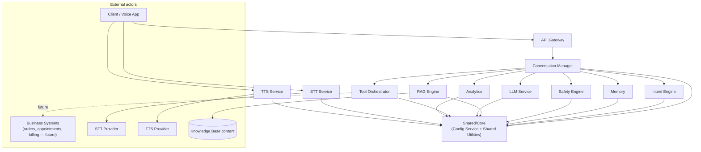

# Modules

**Status:** Frozen
**Version:** 1.0
**Date:** 2026-08-04

This document defines the target module structure for the AI Employee Platform, one level more detailed than `docs/ARCHITECTURE.md`. It is a design document, not an implementation plan — no code is written or changed as a result of it.

Several modules here (Intent Engine, Memory, Tool Orchestrator, Analytics' live-metrics side, STT Service, and Shared/Core's Config Service) do not exist as separate components yet. TTS Service exists today (`src/voice/client_tts.py`). Shared Utilities-equivalent logic exists but only embedded inside other modules' code (see §12b). Each module's entry states its current status honestly rather than implying it's already built. One further gap, `VoiceAssistantInference`, is called out separately as implementation debt rather than folded into individual module statuses — see "Known Implementation Debt" below.

## Naming cross-reference with ARCHITECTURE.md

`ARCHITECTURE.md` names some of these components slightly differently at the system level. Same components, one canonical name per module going forward:

| This document | ARCHITECTURE.md |
|---|---|
| API Gateway | API Layer |
| Conversation Manager | Conversation Manager |
| Safety Engine | Clinical Safety Guard + Handoff Detector |
| RAG Engine | RAG Retriever + Knowledge Layer (Embedding Model, Vector Index, Knowledge Base) |
| LLM Service | Model Layer / "the inference component" |
| Tool Orchestrator | Business Action Layer (future) |
| STT Service | Clients → Voice Client (speech-to-text half — see `ARCHITECTURE_REVIEW.md` finding 1.1) |
| TTS Service | Clients → Voice Client (text-to-speech half) |
| Intent Engine, Memory, Analytics, Shared/Core (Config Service + Shared Utilities) | not named as distinct components in ARCHITECTURE.md |

## Master Dependency Diagram

**Legend:** solid arrows = "calls / depends on." Dotted arrows = not yet implemented. Response/return-value flow is not drawn as separate reverse edges — it follows each call edge back the way it came (a deliberate choice here, since drawing explicit return edges is what produced a false circular-dependency reading in `ARCHITECTURE.md`'s diagram).

Note the two structural guarantees this diagram is meant to make visible: **Conversation Manager is the only module with edges to Intent Engine, Memory, Safety Engine, RAG Engine, LLM Service, Tool Orchestrator, and Analytics** — nothing else calls them directly — and **LLM Service has no edge to Tool Orchestrator or Business Systems at all**; Tool Orchestrator is the sole path to business systems, and only the Conversation Manager can reach it. The Dependency Rules section below states both of these as binding rules, not just diagram observations.

## Dependency Rules

These rules are binding on any implementation, not just descriptive of the diagram above — they're what makes the diagram's acyclic shape enforceable rather than incidental.

1. **Layering.** Every module belongs to exactly one layer:
   - **Entry layer:** API Gateway.
   - **Orchestrated layer:** Conversation Manager — the only module allowed to depend on more than one module in the layer below.
   - **Leaf-service layer:** Intent Engine, Memory, Safety Engine, RAG Engine, LLM Service, Tool Orchestrator, Analytics, STT Service, TTS Service.
   - **Foundation layer:** Shared/Core (Config Service + Shared Utilities) — depended on by every other layer, depends on nothing.

2. **Allowed directions.** Dependencies only point downward: entry → orchestrated → leaf-service → foundation. A module may depend on the layer immediately below it, and on Shared/Core from any layer. A module may never depend on another module in its own layer, or in a layer above it. Example: RAG Engine may not depend on Safety Engine (same layer); Tool Orchestrator may not depend on Conversation Manager (layer above).

3. **Single hub.** Conversation Manager is the only module with edges to more than one leaf-service module. No leaf-service module may call another leaf-service module directly — if two leaf-service modules need to coordinate (e.g. Memory's summarization needing LLM Service's generation, see §4), that coordination is routed through Conversation Manager, not called peer-to-peer.

4. **Shared/Core is the only common dependency.** Shared/Core (§12) is the only module every other module is permitted to depend on in common. A module-to-module dependency is never justified by "both happen to need X" unless X lives in Shared/Core — that is the entire reason Shared/Core exists. If two modules independently need the same logic, that's a Shared/Core extraction, not a new direct dependency between them.

5. **No cycles, by construction.** Because dependencies only point strictly downward through the layers in rule 2, and Shared/Core has zero outbound dependencies (rule 1), a cycle is structurally impossible as long as rules 1–4 hold. This is a stronger guarantee than "the diagram happens not to show one today."

6. **Enforcement gap (known, tracked).** Today's codebase has no package boundaries — modules are wired together via ad hoc `sys.path` insertion per file (e.g. `src/inference/predict.py` inserting `src/rag` onto `sys.path` to import `retriever`; `src/api/server.py` doing the same for `src/inference`), not a package/import structure that could enforce rules 1–5 automatically. Until that changes, these rules are enforced by code review, not tooling. An import-linter or dependency-graph CI check that fails a build on a rule 1–5 violation is recommended future work, not yet built.

## Request-Path vs. Off-Path Diagram

```mermaid
flowchart LR
    subgraph RequestPath["Synchronous request path<br/>(must complete before a response is returned)"]
        direction TB
        APIGateway2["API Gateway"]
        CM2["Conversation Manager"]
        IntentEngine2["Intent Engine"]
        Memory2["Memory"]
        SafetyEngine2["Safety Engine"]
        RAGEngine2["RAG Engine"]
        LLMService2["LLM Service"]
        ToolOrchestrator2["Tool Orchestrator"]
    end

    subgraph OffPath["Off the request path<br/>(best-effort, non-blocking)"]
        direction TB
        Analytics2["Analytics"]
    end

    subgraph Leaf["Leaf dependencies<br/>(no outbound calls to other modules)"]
        direction TB
        SharedCore2["Shared/Core<br/>(Config Service + Shared Utilities)"]
    end

    RequestPath -.emits events, non-blocking.-> OffPath
    RequestPath --> Leaf
    OffPath --> Leaf
```

A failure in Analytics must never fail or delay a live turn — it sits deliberately off the request path. A failure in Shared/Core, by contrast, affects everything, since every request-path module depends on it (Dependency Rule 4). STT Service and TTS Service sit outside this diagram entirely — they're external-client-side adapters the Voice App calls directly (see §10, §11), not part of the server's request path at all.

---

## Known Implementation Debt: VoiceAssistantInference

This document describes target module boundaries. One place today's code and that target diverge enough to call out explicitly, rather than leave scattered across individual "Status" lines: `src/inference/predict.py`'s `VoiceAssistantInference` class is, today, a single ~500-line class that internally does the job of four separate modules described below.

| What it does today | Which module owns it in this document |
|---|---|
| Loads the base model + LoRA adapter, runs generation | §7 LLM Service |
| Decides call order — clinical check → retrieval → prompt assembly → generation → handoff check | §2 Conversation Manager |
| Runs the pre-generation clinical trigger check and the post-generation handoff check (via two separately-configured detector instances) | §5 Safety Engine |
| Retrieves grounding chunks and injects them into the prompt | §6 RAG Engine |

**This is implementation debt, not current architecture.** The module boundaries in §2, §5, §6, and §7 below describe where this logic is supposed to live once separated — they are not a description of `VoiceAssistantInference` as it exists today. Concretely:

- `HandoffDetector` (`src/inference/handoff_detector.py`) and `Retriever` (`src/rag/retriever.py`) are already standalone, independently unit-testable classes with no back-reference to `VoiceAssistantInference` — the *leaf logic* for §5 and §6 already matches this document.
- What is **not** yet separated is the *orchestration* — the decision of when to call the clinical guard, when to retrieve, when to generate, and when to check for handoff — which today lives fused with model-loading code inside one class, rather than in a standalone Conversation Manager that could be tested with LLM Service, Safety Engine, and RAG Engine mocked (per §2's Unit Test Boundary).
- This is tracked as `ARCHITECTURE_REVIEW.md` finding 3.1 (High severity): the "independently testable" principle stated in `ARCHITECTURE.md` Core Principle 7 is not yet true in practice, for this reason.

**No code changes are implied by this document.** This section exists so the target module boundaries below aren't mistaken for a description of what `VoiceAssistantInference` already is.

---

## 1. API Gateway

**Purpose:** Single network entry point for all clients. Translates transport-level requests into calls to the Conversation Manager and streams responses back. Carries no business or safety logic itself.

**Responsibilities:**
- Terminate client connections (health checks, conversation requests).
- Validate request shape at the schema level only (not business validation).
- Marshal streaming vs. non-streaming responses.
- Attach/propagate a request correlation ID for Analytics.
- Own transport-level concerns as they're added (authentication, rate limiting) — currently absent, tracked as a known gap.

**Public Interfaces:**
- `GET /health` → liveness/readiness status.
- `POST /generate` → one conversation turn; delegates to `ConversationManager.turn(...)`.

**Inputs:** HTTP request — user message, prior turns, streaming preference.

**Outputs:** HTTP response — response text plus structured turn metadata (handoff flag/confidence, retrieved sources, clinical-guard status), or an equivalent streamed event sequence.

**Dependencies:** Conversation Manager only. No direct dependency on Intent Engine, Safety Engine, RAG Engine, LLM Service, or Tool Orchestrator — everything is mediated through the Conversation Manager.

**Error Handling:** Malformed requests are rejected before reaching the Conversation Manager. Conversation Manager failures are mapped to a generic error response — no internal state, prompts, or stack traces are exposed to the client. Slow turns are bounded by a request timeout that returns a degraded "try again" response rather than hanging indefinitely.

**Unit Test Boundary:** Testable with the Conversation Manager stubbed — verifies request validation, response shaping, and streaming framing without a real model, retriever, or safety engine.

**Status:** implemented.

---

## 2. Conversation Manager

**Purpose:** Own the per-turn control flow. Decide the order in which every other module is invoked for a given turn, and assemble the final response. This is the orchestration layer described in `ARCHITECTURE.md` Core Principle 1.

**Responsibilities:**
- Read/update conversation state via Memory.
- Invoke Intent Engine to classify the turn.
- Invoke Safety Engine's pre-generation check; may short-circuit the turn before generation.
- Invoke RAG Engine for grounding context when the classified intent calls for it.
- Invoke LLM Service with the assembled prompt.
- Invoke Safety Engine's post-generation check on the LLM's output.
- Invoke Tool Orchestrator when intent and/or output indicate a business action is needed (future) — see §8's Ownership subsection for the full LLM-output-to-action translation this module owns.
- Emit turn events to Analytics.
- Own all cross-module fallback/degradation policy in one place, rather than letting each module decide its own user-facing behavior on failure.

**Public Interfaces:**
- `turn(message: str, history: list[Turn], session_id: Optional[str]) -> TurnResult`
- Streaming variant: yields text chunks, then a final `TurnResult`.

**Inputs:** user message, prior turns, optional session identifier.

**Outputs:** `TurnResult` — response text, handoff flag/confidence, retrieved chunks, clinical-guard status, classified intent, latency.

**Dependencies:** Intent Engine, Memory, Safety Engine, RAG Engine, LLM Service, Tool Orchestrator (future), Analytics, Shared/Core. This is intentionally the only module allowed to depend on all the others — see Dependency Rule 3 and Communication Rules in `ARCHITECTURE.md`.

**Error Handling:** Every downstream failure is caught here and translated into a safe default (`ARCHITECTURE.md` Core Principle 5, "fail safe, not silent") — e.g. RAG Engine unavailable → proceed ungrounded with a degraded-grounding flag, rather than fail the turn; LLM Service failure → a fixed apology-and-handoff response, never a raw exception surfaced to the client.

**Unit Test Boundary:** Testable with all six downstream modules mocked, verifying orchestration order and fallback policy (e.g. "if Safety Engine flags a clinical trigger, LLM Service.generate is never called") without loading a real model or index. This is currently the most valuable *missing* test boundary — see "Known Implementation Debt" above and `docs/ARCHITECTURE_REVIEW.md` finding 3.1: today this orchestration logic is not separable from the model-loading code, so this test boundary doesn't yet exist in practice.

**Status:** logical component today, not a standalone module — see cross-reference table above and "Known Implementation Debt" above.

---

## 3. Intent Engine

**Purpose:** Classify a user turn into an intent category so the Conversation Manager can decide which downstream modules to invoke, instead of that decision being implicit in the LLM's behavior or duplicated ad hoc across modules.

**Responsibilities:**
- Classify each turn against a fixed, versioned intent taxonomy (e.g. `knowledge_lookup`, `appointment_action`, `escalation_request`, `clinical_question`, `out_of_domain`, `chit_chat`).
- Report a confidence score alongside the classification, to the same standard as Safety Engine.
- Stay stateless and independently testable against a fixed labeled example set, whatever classification approach is used internally.

**Public Interfaces:**
- `classify(message: str, history: list[Turn]) -> IntentResult { intent, confidence }`

**Inputs:** current user message, optionally recent history for disambiguation.

**Outputs:** `IntentResult` — intent label and confidence.

**Dependencies:** Shared/Core (Config Service: taxonomy, thresholds; Shared Utilities: text normalization — see §12). No dependency on RAG Engine, LLM Service, or Safety Engine — classification must not require retrieval or generation to have already happened.

**Error Handling:** Unclassifiable input defaults to a conservative fallback intent (the broadest, safest category) rather than raising — the Conversation Manager must never be blocked by a classification failure.

**Unit Test Boundary:** Fully offline against a fixed table of (utterance → expected intent) pairs; no model or network dependency required.

**Status:** not yet implemented. Intent-shaped decisions are currently made implicitly — by the Safety Engine's clinical trigger check and by the LLM's own in-band behavior for handoff phrasing — rather than by a dedicated upstream classifier.

---

## 4. Memory

**Purpose:** Own conversation state so the Conversation Manager doesn't have to — at minimum the current conversation's turn history, and in future, longer-lived session or user context.

**Responsibilities:**
- Append each completed turn to a conversation's stored history.
- Retrieve a conversation's history for the Conversation Manager at the start of a turn.
- Keep stored history within a bounded size via summarization and truncation (see strategy below), so history size doesn't grow unbounded per conversation — directly addressing `ARCHITECTURE_REVIEW.md` finding 4.1 (unbounded per-turn cost/latency growth).
- Clear a conversation's stored state on request (explicit end-of-conversation, or a retention-policy expiry — see `docs/DATABASE.md`).
- (Future) Enforce a retention/expiry policy for stored history (see `docs/DATABASE.md`).

**Public Interfaces:**
- `append(session_id: str, user_turn: Turn, assistant_turn: Turn) -> None` — persist one completed turn.
- `retrieve(session_id: str, max_turns: Optional[int] = None) -> list[Turn]` — return the conversation's history (running summary turn, if any, followed by the verbatim recent window — see strategy below), optionally capped at `max_turns`.
- `summarize(session_id: str, summary_text: str, through_turn_index: int) -> SummaryResult { summary_text, turns_summarized }` — persist `summary_text` as the running summary covering all turns up to `through_turn_index`, replacing them in `retrieve()`'s output. Memory does not generate this text itself — see strategy below for who does, and why.
- `truncate(session_id: str, keep_last_n: int) -> None` — drop turns beyond `keep_last_n`, retaining only the most recent ones (and the running summary in their place, if `summarize()` has already run).
- `clear(session_id: str) -> None` — discard a conversation's stored state entirely.

**Summarization and truncation strategy:**
- **Trigger:** when a conversation's stored history exceeds a configured turn count or token budget (Shared/Core `get_memory_config()` — see §12a), Conversation Manager calls `summarize()` before the next `retrieve()`, rather than passing every raw turn to LLM Service on every request.
- **Approach — sliding window + running summary:** the most recent `keep_last_n` turns (configurable) are kept verbatim for conversational continuity; everything older is collapsed into a single running summary. Generating that summary text is itself a text-generation call — per Dependency Rule 3, only Conversation Manager may route a generation call through LLM Service, so the flow is: Conversation Manager notices the trigger → assembles a summarization prompt over the turns to be collapsed → calls `LLM Service.generate()` → calls `Memory.summarize(session_id, summary_text, through_turn_index)` to persist the result. Memory's role is strictly storage and composition, never generation — this keeps Memory's own dependency graph at zero, consistent with Dependency Rule 3.
- **Composition:** `retrieve()` returns the running summary (if one exists) as a synthetic leading turn, followed by the verbatim `keep_last_n` window — giving Conversation Manager a bounded-size history regardless of true conversation length.
- **Truncation as a fallback:** if summarization is unavailable or fails (an LLM Service error), Conversation Manager calls `truncate()` instead — a cheaper, lossier fallback that drops the oldest turns outright rather than summarizing them, consistent with Memory's existing fail-safe posture below.

**Inputs:** session identifier, turn content, and (from Conversation Manager) already-generated summary text when summarizing.

**Outputs:** ordered list of prior turns, optionally summarized/truncated.

**Dependencies:** Shared/Core (Config Service: retention policy, truncation thresholds, summarization trigger point — see §12a). No dependency on any other module for storage itself — `summarize()`'s underlying generation call is made by Conversation Manager through LLM Service, never by Memory directly.

**Error Handling:** A read/write failure degrades to treating the conversation as fresh (empty history) rather than failing the turn — losing history is recoverable; failing the turn is not. A summarization failure (at the Conversation Manager / LLM Service level) falls back to `truncate()` rather than failing the turn, for the same reason.

**Unit Test Boundary:** Testable purely against its own storage contract (an in-memory fake, or a real backing store in isolation) — no dependency on the Conversation Manager, LLM Service, or any other module. `summarize()`'s test boundary is the storage/composition logic (does it persist and compose correctly given a summary text and a cutoff index) — the actual text-generation call is Conversation Manager/LLM Service's concern, not Memory's, and is mocked here.

**Status:** not yet implemented. The platform is currently stateless by design — the caller supplies full history on every request (`ARCHITECTURE.md` §8). This entry documents where that responsibility, including summarization/truncation, would live if server-side state is introduced.

---

## 5. Safety Engine

**Purpose:** Provide deterministic, rule-based safety and escalation decisions that don't depend on trusting the LLM's judgment — both before generation (should this turn even reach the model) and after (did the model's output signal a need to hand off).

**Responsibilities:**
- Pre-generation: evaluate the user's turn against a clinical/hard-safety trigger set; if matched, signal the Conversation Manager to skip generation entirely.
- Post-generation: evaluate the LLM's output for handoff/escalation intent — paraphrase-tolerant and confidence-scored, not brittle substring matching.
- Surface which rule/layer/pattern matched, for auditability.
- Stay fully configurable (phrase lists, regex, synonym sets, thresholds) with no behavior hardcoded in logic.

**Important internal note** (see `docs/ARCHITECTURE_REVIEW.md` finding 3.2): the clinical check and the handoff check are two configurations of the *same* underlying layered-matching engine, not two independently implemented components. This is intentional reuse, not accidental coupling — but it means a change to the shared matching engine must be regression-tested against both configurations before shipping, since a fix aimed at one can change behavior in the other.

**Public Interfaces:**
- `check_clinical(message: str) -> SafetyMatch { triggered, confidence, evidence }`
- `check_handoff(response_text: str) -> SafetyMatch { triggered, confidence, evidence }`

**Inputs:** raw user message (clinical check) or raw LLM output text (handoff check).

**Outputs:** `SafetyMatch` — boolean decision, confidence, and human-readable evidence of what matched.

**Dependencies:** Shared/Core (Config Service: phrase lists, regex, synonym sets, thresholds; Shared Utilities: text normalization/matching helpers — see §12). No dependency on LLM Service, RAG Engine, Memory, or Intent Engine — must be evaluable in complete isolation.

**Error Handling:** An internal error (e.g. malformed config) must fail toward the safe default — treat as triggered/escalate — never fail silently toward "not triggered." This is the one module where "fail closed" is correct, the opposite of most other modules' fallback policy.

**Unit Test Boundary:** Fully offline, no model or network dependency — every rule, pattern, and threshold is testable against fixed input strings. (The matching logic itself already meets this boundary today — see "Known Implementation Debt" above for what doesn't yet.)

**Status:** implemented.

---

## 6. RAG Engine

**Purpose:** Given a user turn, return the most relevant grounding content from the knowledge base, so the LLM Service answers from retrieved facts rather than parametric memory.

**Responsibilities:**
- Maintain a searchable vector index derived from the knowledge base, rebuilding it when stale.
- Embed incoming queries with the same embedding model used to build the index.
- Return top-k relevant chunks with similarity scores, optionally filtered by domain.

**Public Interfaces:**
- `retrieve(query: str, top_k: int, domain: Optional[str]) -> list[RetrievedChunk] { id, domain, title, content, score }`
- `rebuild_index() -> IndexBuildReport`

**Inputs:** query text, optional domain filter, top_k.

**Outputs:** ranked list of retrieved chunks with scores.

**Dependencies:** Shared/Core (Config Service: embedding model choice, index/knowledge paths, top_k/threshold defaults — see §12a). Reads Knowledge Base content (data, not a module). No dependency on LLM Service, Safety Engine, Intent Engine, Memory, or Tool Orchestrator.

**Error Handling:** A missing/corrupt index is rebuilt from source content before failing. A genuine retrieval failure (e.g. embedding backend unavailable) returns an empty result set rather than raising — the Conversation Manager's fallback policy treats "no grounding available" as a degraded-but-valid state, not a hard failure.

**Unit Test Boundary:** Testable against a small fixture knowledge base (not the production one), verifying indexing and retrieval correctness independent of the LLM Service or Conversation Manager. (This boundary already holds today for the retrieval logic itself — see "Known Implementation Debt" above for what doesn't yet.)

**Status:** implemented.

---

## 7. LLM Service

**Purpose:** Generate natural-language text from an assembled prompt. The platform's only text-generation capability, and the only module that loads/runs the model.

**Responsibilities:**
- Load the base model and fine-tuning adapter, resolving which checkpoint to use.
- Accept a fully-assembled prompt (system instructions + retrieved context + history + user turn) and generate a response, optionally streamed.
- Report generation metadata (latency, token/word counts) for Analytics.
- Nothing else — no retrieval, no safety checks, no tool calls, no knowledge of business logic.

**Public Interfaces:**
- `generate(prompt: PromptBundle, max_new_tokens: int) -> GenerationResult { text, latency_ms }`
- `generate_stream(prompt: PromptBundle, max_new_tokens: int) -> Iterator[str | GenerationResult]`

**Inputs:** an already-assembled prompt bundle — the LLM Service does not decide what goes into the prompt; that's the Conversation Manager's responsibility, informed by RAG Engine and Memory. Memory's `summarize()` flow (§4) is the one other caller of `generate()`, also routed through Conversation Manager, never directly.

**Outputs:** generated text (streamed or complete) plus generation metadata.

**Dependencies:** Shared/Core (Config Service: model/adapter paths, generation parameters — see §12a) only. Per `ARCHITECTURE.md` Core Principle 2 and Communication Rule 5, the LLM Service must never call RAG Engine, Safety Engine, Tool Orchestrator, or anything else — everything it needs arrives in the prompt it's given.

**Error Handling:** Generation failures (out of memory, checkpoint load failure, timeout) surface as a typed error to the Conversation Manager, which decides the user-facing fallback. The LLM Service itself never apologizes to the user or makes a safety decision.

**Unit Test Boundary:** Interface/contract-level tests can run with the model stubbed; true generation-quality tests require the real model loaded and are necessarily slower. Keeping this boundary explicit matters so fast unit tests don't get coupled to model load time — see "Known Implementation Debt" above for why this distinction is currently blurred in practice.

**Status:** implemented.

---

## 8. Tool Orchestrator

**Purpose:** The only module permitted to invoke external business systems (orders, appointments, billing, etc.) on behalf of a conversation — the enforcement point for `ARCHITECTURE.md` Core Principle 2 ("the LLM never calls business APIs directly") and Communication Rule 7.

**Responsibilities:**
- Expose a fixed, versioned set of business actions the Conversation Manager may invoke — never an arbitrary action specified freely by the LLM's output.
- Declare, per action, whether it requires an explicit confirmation step before executing (see Ownership below) — irreversible actions (cancellations, billing changes) are flagged `requires_confirmation: true` on the action's `ActionSpec`.
- Validate that a requested action is permitted for the conversation's intent, including enforcing any required confirmation step, before executing it.
- Call the underlying business API/service, own its own retries/timeouts, and normalize the response for the Conversation Manager.
- Never accept raw LLM output as an executable instruction — only the Conversation Manager decides whether and which action to invoke, informed by (not dictated by) the LLM's response and the Intent Engine's classification.

**Ownership and responsibilities — the LLM-output-to-action boundary:**

This is the translation layer previously left as an open question and flagged as a missing interface in the `docs/MODULES_REVIEW.md` review. The division of ownership:

- **Conversation Manager owns the decision.** It is the only module allowed to call `Tool Orchestrator.invoke(...)`. It decides *whether* a turn warrants a business action and *which* action, using the Intent Engine's classification (e.g. `appointment_action`) plus the LLM's generated response as signal — never as a direct instruction. The LLM's raw text is never passed through to `invoke()`; Conversation Manager maps it to one of Tool Orchestrator's fixed, versioned `ActionSpec` entries plus explicit, typed `params`.
- **Tool Orchestrator owns validation and execution.** Given a specific `action` name and `params`, it validates that the action exists, that `params` matches the action's declared schema, and that any `requires_confirmation` flag has been satisfied — Conversation Manager must pass an explicit `confirmed: bool`, and Tool Orchestrator rejects a `requires_confirmation` action invoked with `confirmed=False` — before calling the underlying business API.
- **Neither module trusts the LLM's output as ground truth.** The LLM's response is one input Conversation Manager reasons about, not a command Tool Orchestrator executes.

**Public Interfaces:**
- `list_actions() -> list[ActionSpec]` — the fixed, versioned catalog of invocable actions.
  - `ActionSpec { name: str, description: str, params_schema: dict, requires_confirmation: bool }`
- `invoke(request: ActionRequest) -> ActionResult`

**Request contract:**
- `ActionRequest { action: str, params: dict, session_id: str, confirmed: bool = False }` — `action` must match a name from `list_actions()`; `params` must satisfy that action's `params_schema`; `confirmed` must be `True` if the action's spec sets `requires_confirmation`.

**Response contract:**
- `ActionResult { status: "success" | "failure" | "confirmation_required", data: Optional[dict], error: Optional[str] }` — `confirmation_required` is returned (not raised) when Conversation Manager invokes a `requires_confirmation` action with `confirmed=False`, so Conversation Manager can surface a confirmation prompt to the user and re-invoke with `confirmed=True` on a later turn.

**Inputs:** an `ActionRequest` — a specific, named action plus validated parameters and confirmation state — never free-form model output.

**Outputs:** an `ActionResult` (success/failure/confirmation-required plus data).

**Dependencies:** Shared/Core (Config Service: which business APIs are enabled/reachable; references to credentials, not raw secrets — see §12a). No dependency on LLM Service, RAG Engine, Safety Engine, or Intent Engine — invoked by, and reports back only to, the Conversation Manager.

**Error Handling:** Business API failures/timeouts return a structured `ActionResult{status: "failure", error: ...}` to the Conversation Manager rather than raising uncaught; the Conversation Manager decides whether to retry, degrade to "I can't complete that right now," or escalate — the Tool Orchestrator itself never decides to escalate.

**Unit Test Boundary:** Testable against a mocked business API layer, verifying action validation, confirmation gating, and result normalization without a real external dependency or a real model.

**Status:** not yet implemented. No business actions exist yet; the platform is currently retrieval/informational only. This entry now documents the request/response contract and confirmation-gating design so implementation has a concrete interface to build to, rather than deferring that decision to implementation time.

---

## 9. Analytics

**Purpose:** Capture what happened during a turn — for offline evaluation (regression testing) today, and live observability in future — without ever being on the critical path of producing a response.

**Responsibilities:**
- Record per-turn events (intent, retrieval hits, safety decisions, handoff decisions, latency) emitted by the Conversation Manager.
- Aggregate results for the offline evaluation benchmark (accuracy, retrieval hit-rate, latency percentiles).
- (Future) Export live metrics/traces for production observability.
- Never influence the outcome of the turn it's recording — a passive observer only.

**Public Interfaces:**
- `record_turn(event: TurnEvent) -> None`
- `run_benchmark(cases: list[BenchmarkCase]) -> BenchmarkReport` (offline)

**Inputs:** structured turn events from the Conversation Manager; benchmark case definitions (offline).

**Outputs:** aggregated reports — offline benchmark reports today, live dashboards/metrics in future.

**Dependencies:** Shared/Core (Config Service: benchmark definitions, reporting thresholds; Shared Utilities — see §12). Consumes events from the Conversation Manager but must never be something the Conversation Manager blocks on.

**Error Handling:** Recording failures are logged and dropped, never propagated back to affect the user-facing turn — best-effort by design.

**Unit Test Boundary:** The offline benchmark path is testable end-to-end against fixed benchmark cases. Live-event recording (once built) should be testable by asserting on emitted events with the rest of the pipeline mocked.

**Status:** partially implemented. The offline evaluation harness (benchmark generation, metrics, latency percentiles, retrieval hit-rate) exists today; live/production analytics do not.

---

## 10. STT Service

Splitting the former "Voice Pipeline" entry into STT Service (this entry) and TTS Service (§11) does not create a new orchestration point. Turn-level orchestration — deciding intent, retrieval, safety, and generation order — remains exclusively Conversation Manager's responsibility (§2), unchanged by this split. STT/TTS orchestration is limited to client-side audio sequencing (capture → transcribe → send text to API Gateway → receive text → synthesize → play), which was already outside Conversation Manager's scope before the split and remains so — it's the responsibility of the external Client/Voice App, not of either service below.

**Purpose:** Convert spoken user audio into text. A pure adapter around a speech-to-text provider — no conversational logic, no knowledge of the API Gateway or Conversation Manager.

**Responsibilities:**
- Accept a captured audio stream from the client.
- Transcribe it to text via a configured STT provider.
- Report transcription confidence/quality metadata if the provider supports it, so the caller can decide whether to prompt the user to repeat.
- Nothing else — routing the transcribed text to the API Gateway is the calling client's responsibility, not this service's; STT Service does not call API Gateway itself.

**Public Interfaces:**
- `transcribe(audio: AudioStream) -> TranscriptionResult { text, confidence }`

**Inputs:** microphone audio.

**Outputs:** transcribed text plus confidence.

**Dependencies:** Shared/Core (Config Service: provider selection, credentials reference, language/model settings — see §12a) only. External STT provider as a separate, swappable dependency. No dependency on API Gateway, Conversation Manager, or any other module — the client (not STT Service) sequences "transcribe, then call API Gateway."

**Error Handling:** A transcription failure (unintelligible audio, provider error) returns a typed error/low-confidence result rather than raising unrecoverably into the caller; the calling client decides whether to prompt the user to repeat. Not treated as a safety-relevant event by itself.

**Unit Test Boundary:** Testable against recorded audio fixtures with the provider mocked — no dependency on API Gateway, Conversation Manager, or a running model.

**Status:** not yet implemented. This is the same gap `ARCHITECTURE_REVIEW.md` finding 1.1 identified — today's voice client produces/consumes text, not audio, on the input side. Splitting the former Voice Pipeline entry into STT Service and TTS Service doesn't change that status; it gives the still-missing STT capability its own module boundary instead of leaving it undifferentiated inside a combined entry.

---

## 11. TTS Service

**Purpose:** Convert the assistant's text response into spoken audio for playback. A pure adapter around a text-to-speech provider — no conversational logic, no knowledge of the API Gateway or Conversation Manager.

**Responsibilities:**
- Accept response text (and, optionally, streamed text chunks) from the client.
- Synthesize it to audio via a configured TTS provider, incrementally if the provider/client support streaming playback.
- Nothing else — receiving the response from the API Gateway and deciding when to start synthesis is the calling client's responsibility, not this service's; TTS Service does not call API Gateway itself.

**Public Interfaces:**
- `synthesize(text: str) -> AudioStream`
- `synthesize_stream(text_chunks: Iterator[str]) -> Iterator[AudioChunk]` — incremental variant, matching today's sentence-chunked playback pattern.

**Inputs:** assistant response text (complete or streamed).

**Outputs:** synthesized audio.

**Dependencies:** Shared/Core (Config Service: provider selection, voice ID, credentials reference — see §12a) only. External TTS provider as a separate, swappable dependency. No dependency on API Gateway, Conversation Manager, or any other module.

**Error Handling:** A synthesis failure falls back to text-only display rather than failing the interaction. Not treated as a safety-relevant event by itself.

**Unit Test Boundary:** Testable against fixed text inputs with the provider mocked — no dependency on API Gateway, Conversation Manager, or a running model.

**Status:** implemented. `src/voice/client_tts.py` provides this today (ElevenLabs-backed, sentence-chunked streaming synthesis) — currently combined in one client script together with the API-calling/sequencing logic this decomposition assigns to "the client," not to TTS Service itself. Extracting a standalone `synthesize()`/`synthesize_stream()` boundary out of that script is the remaining gap between today's code and this entry.

---

## 12. Shared/Core

**Purpose:** Single foundation module every other module depends on for two kinds of cross-cutting concern that must not be duplicated per-module: configuration loading (**Config Service**, §12a) and small stateless helper logic (**Shared Utilities**, §12b). Per Dependency Rule 4, this is the *only* dependency modules are allowed to have in common — anything two or more modules both need belongs here, not copy-pasted or re-implemented per module.

Shared/Core has two internal components with distinct responsibilities. They ship as one module because both are zero-dependency, foundation-layer code with the same consumer set — not because they're the same kind of logic.

### 12a. Config Service

**Purpose:** The single, consistent way every other module loads tunable parameters (thresholds, phrase/rule sets, model/index paths, feature flags) without hardcoding them in logic — the mechanism behind `ARCHITECTURE.md` Core Principle 6. This replaces each module owning its own configuration-loading code.

**Responsibilities:**
- Load structured configuration from versioned files at startup, with reload support for values that are safe to hot-tune.
- Validate configuration shape and fail fast at startup, not mid-request.
- Provide each module a scoped, typed view of configuration relevant to it, rather than exposing the entire configuration surface everywhere.
- Fall back to safe built-in defaults if a configuration source is missing, so the platform degrades gracefully rather than failing to start.
- Own every module's configuration file format and load path — no module reads its own YAML/JSON config file directly; every module receives configuration through the Config Service's typed accessors.

**Public Interfaces:**
- `get(section: str) -> dict` — generic access.
- Typed accessors, one per consuming module: `get_safety_config()`, `get_rag_config()`, `get_intent_config()`, `get_memory_config()`, `get_llm_config()`, `get_tool_orchestrator_config()`, `get_analytics_config()`, `get_stt_config()`, `get_tts_config()`. Each returns a typed object scoped to that module's own configuration surface, not the full configuration tree.

**Inputs:** configuration files on disk (or, in future, a remote config service).

**Outputs:** validated, typed configuration objects for the requesting module.

**Dependencies:** none — foundation layer, depended on by everything else.

**Error Handling:** Missing/malformed configuration falls back to built-in safe defaults with a loud startup warning, rather than crashing the platform or silently running undefined. The one deliberate exception: Safety Engine's rule sets failing to load is treated as a startup-blocking error, not a silent fallback, since a safety component running with no rules is worse than not starting — this exception is expressed as a policy `get_safety_config()` itself enforces (it raises rather than falling back), not a special case inside the Config Service's general loading path.

**Unit Test Boundary:** Fully offline — tests supply fixture configuration files/dicts and assert on the resulting validated objects and default-fallback behavior, with no dependency on any other module.

**Status:** not yet implemented as a standalone service. Today, five modules independently implement their own configuration-loading code (`src/eval/evaluate.py`, `src/inference/predict.py`, `src/inference/handoff_detector.py`, `src/export/merge_and_convert.py`, `src/training/config.py`) — exactly the duplication the Config Service is meant to eliminate. This entry documents the target: one loader, typed per-module accessors, everything else calling in rather than reading its own file.

### 12b. Shared Utilities

**Purpose:** Home for small, cross-cutting logic used by multiple modules that isn't business logic itself, so it's implemented once and tested once instead of drifting into slightly different copies per module.

**Responsibilities:**
- Text normalization helpers (used by, e.g., Safety Engine and Intent Engine) — the target extraction point for the `normalize()` logic currently implemented privately inside Safety Engine's matching code.
- Common data types/contracts shared across module boundaries (e.g. a consistent Turn/Chunk/ActionResult shape), including a shared serialization convention (e.g. a common base dataclass or `to_dict` helper) so result records don't each hand-roll their own.
- Logging/formatting helpers used by Analytics and other modules.
- Anything duplicated across two or more modules today is a candidate to move here — this component has no business logic of its own, and per Dependency Rule 4, is the only place shared-but-not-configuration logic is allowed to live.

**Public Interfaces:** varies by utility; each is documented where it's introduced rather than enumerated exhaustively here.

**Inputs / Outputs:** not defined at the component level — inputs/outputs belong to each individual utility.

**Dependencies:** none — foundation layer, like Config Service. No calls out to any other module, or it stops being "shared" and becomes a hidden coupling point.

**Error Handling:** Utilities raise clear, typed errors on invalid input and never silently swallow errors on a caller's behalf — deciding *what to do* about an error is the calling module's responsibility, not this one's.

**Unit Test Boundary:** Every utility is unit-testable in complete isolation, by definition — if something here can't be tested without another module, it doesn't belong in Shared Utilities.

**Status:** not yet formalized as a component. Equivalent logic exists today inside Safety Engine's matching code (text-normalization helpers) and independently inside `RetrievedChunk`, `Chunk`, and `HandoffMatch` (each hand-rolling its own `to_dict()`) — both are extraction candidates, not yet extracted.

---

## Open Questions

- Should Intent Engine's classification be rule-based (consistent with Safety Engine's testability standard) or model-based, and if model-based, does it share the LLM Service or use a separate, smaller classifier?
- Where does Memory's backing store live operationally, and what's the retention policy for conversation history containing potentially sensitive content (see `docs/DATABASE.md`)? Note: the summarization/truncation *strategy* is now defined in §4 — this question is only about the storage backend and retention policy, not the in-memory shape.
- ~~Does Tool Orchestrator need a human-confirmation step built into its interface for irreversible actions, or is that entirely the Conversation Manager's responsibility?~~ **Resolved — see §8.** Tool Orchestrator declares `requires_confirmation` per action and rejects an unconfirmed invocation; Conversation Manager is responsible for surfacing the confirmation prompt to the user and re-invoking with `confirmed=True`.
- Should Config Service support runtime hot-reload for all sections, or only non-safety-critical ones (given Safety Engine's fail-startup-not-silent exception)?
