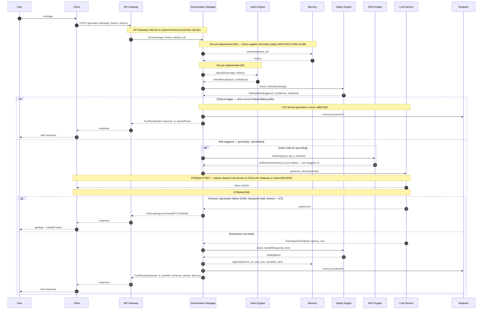
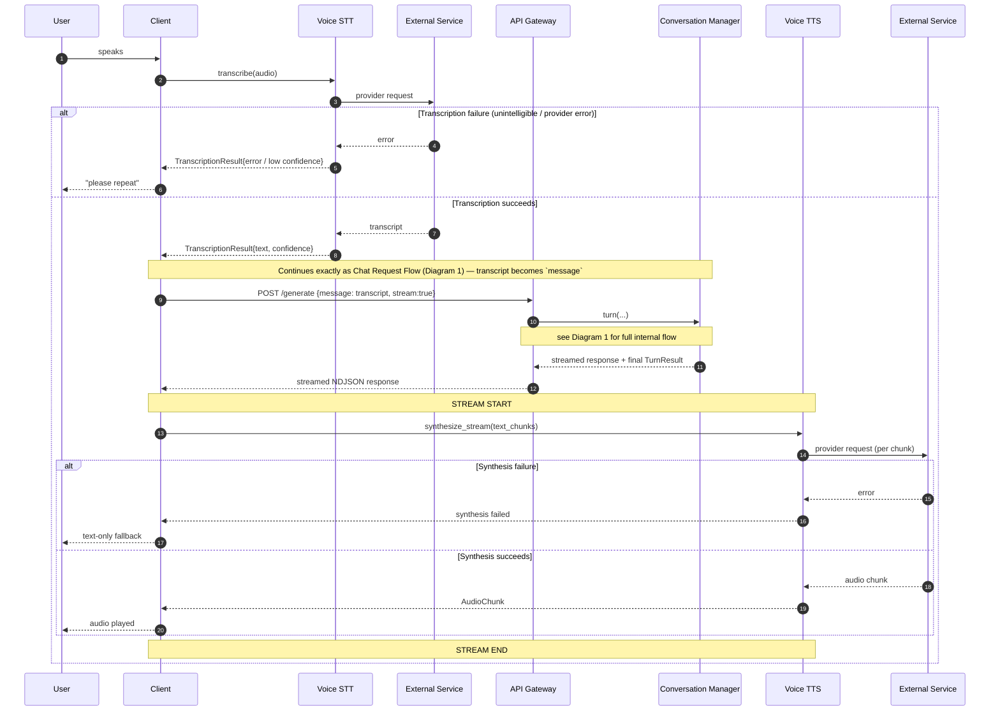
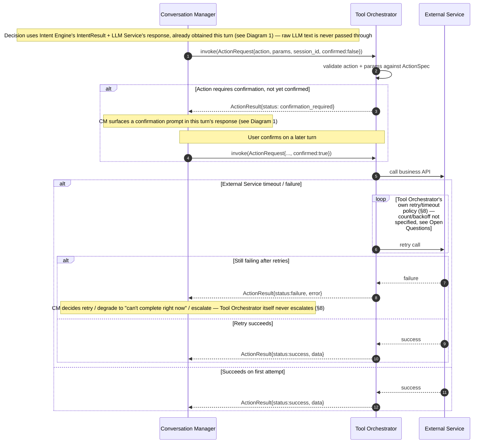
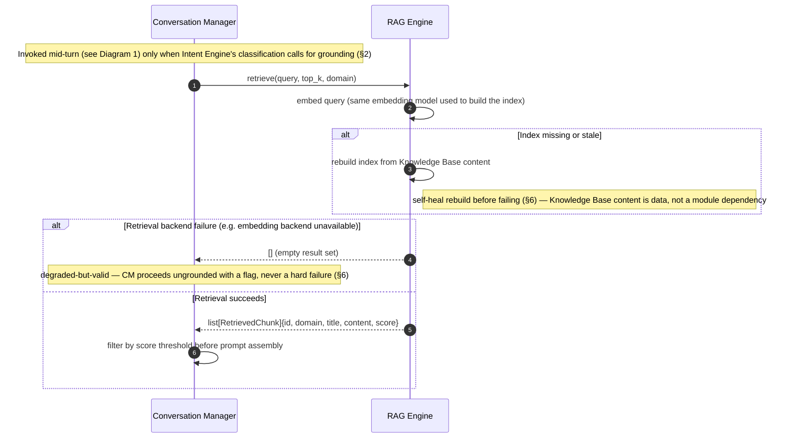
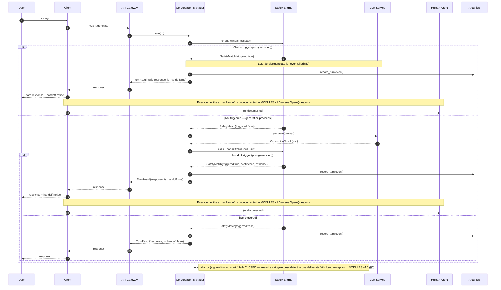
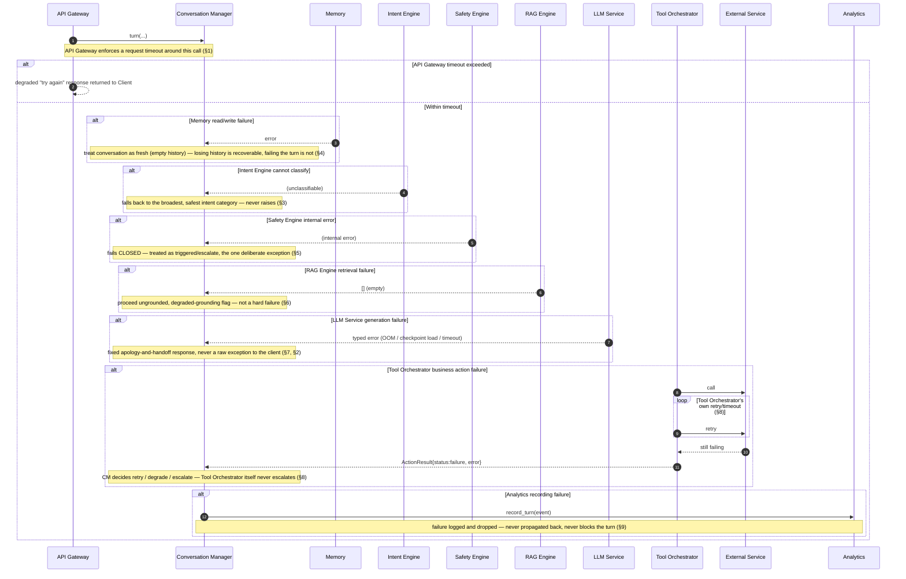

# Sequence Diagrams

**Status:** Frozen
**Version:** 1.0
**Date:** 2026-08-04

**Targets:** `docs/ARCHITECTURE.md` and `docs/MODULES.md` v1.0 (Frozen).
**Purpose of this document:** show *how* the frozen module boundaries interact turn-by-turn — request path, response path, failure path, timeout path, retry path, and streaming behavior — without changing what those boundaries are.

This document does not restate `ARCHITECTURE.md` or `MODULES.md` content; every module responsibility, dependency, and interface claim below is a pointer (`§N`) into `MODULES.md`, not a re-derivation of it. Where drawing a complete diagram required an assumption `MODULES.md` doesn't settle, that assumption is called out explicitly rather than folded silently into the picture — and where a diagram exposes a genuine gap, it is filed under that diagram's **Open Questions** and rolled up into **Inputs for Version 1.1** at the end, not resolved here.

No modules were added, renamed, or re-owned to produce this document. No implementation was read, written, or modified in the course of producing it — see "Known Implementation Debt" in `MODULES.md` for the standing gap between these target flows and today's code.

## Legend & Conventions

- **Solid arrow (`->>`/`-->>`)** — implemented today, per the module's MODULES v1.0 `Status` line.
- **Dashed/async arrow (`--)`)** or a `Note` calling out "not yet implemented" — target-state only, per MODULES v1.0 `Status`. Matches the dotted-arrow convention MODULES.md's own diagrams already use.
- **`alt` / `else`** — mutually exclusive branches (happy path vs. failure/timeout).
- **`opt`** — a branch taken conditionally, not exclusively.
- **`loop`** — an internally-owned retry, only drawn where MODULES v1.0 explicitly assigns a module its own retry/timeout policy (this is rare — see each diagram's Invariants).
- **`Note over X,Y: STREAM START` / `STREAM END`** — brackets a streaming interface's active window, per the module's documented streaming interface (`generate_stream`, `synthesize_stream`, the API Gateway NDJSON mode).

**Fixed participant vocabulary** (identical spelling in every diagram below — no renaming):

| Participant | MODULES v1.0 mapping |
|---|---|
| User | external human actor — not a module |
| Client | external actor ("Client / Voice App") — not a module |
| API Gateway | §1 |
| Conversation Manager | §2 |
| Safety Engine | §5 |
| Intent Engine | §3 |
| Memory | §4 |
| RAG Engine | §6 |
| LLM Service | §7 |
| Tool Orchestrator | §8 |
| Analytics | §9 |
| Voice STT | §10 |
| Voice TTS | §11 |
| External Service | generic stand-in for any third-party dependency (STT/TTS provider, business API) — never a platform module |
| Human Agent | external human actor — the handoff destination; not a module (see Diagram 5 Open Questions) |

**Scope exclusion:** Shared/Core (§12, Config Service + Shared Utilities) is a startup-time foundation dependency, not a per-turn call — per Dependency Rule 1 it's loaded once, not invoked mid-turn. It is intentionally omitted from every diagram below rather than repeated as a no-op edge on every participant.

---

## 1. Chat Request Flow

### Purpose
The core text-turn path: a user message enters through API Gateway, is orchestrated end-to-end by Conversation Manager, and a response (or a safe short-circuit) comes back — with streaming. Every other diagram in this document either extends this flow (Diagram 2) or zooms into one step of it (Diagrams 3–5); Diagram 6 catalogs what happens when any step here fails.

### Mermaid Diagram

### Invariants
- Conversation Manager is the only participant with edges to Intent Engine, Memory, Safety Engine, RAG Engine, LLM Service, and Analytics — nothing else calls them directly (Dependency Rule 3, §2).
- LLM Service never calls RAG Engine, Safety Engine, Tool Orchestrator, or anything else — it only receives an assembled prompt and returns text (§7).
- If Safety Engine's clinical check triggers, LLM Service.generate is never invoked for that turn (§2 Unit Test Boundary).
- API Gateway carries no business or safety logic of its own (§1) — every branch above is a Conversation Manager decision, not an API Gateway one.
- Analytics never blocks or alters the outcome of the turn it's recording (§9).

### Design Notes
- Memory and Intent Engine calls are drawn because they're part of the *target* v1.0 flow, but both are marked "not yet implemented" per MODULES v1.0 — see Known Implementation Debt in `MODULES.md`.
- The clinical short-circuit and the post-generation handoff check are two configurations of the same Safety Engine matching engine (§5) — see Diagram 5 for the dedicated handoff view.
- RAG Engine's failure handling is intentionally not expanded here — see Diagram 4.

### Assumptions
- The order Memory → Intent Engine → Safety Engine (pre-gen) shown here follows §2's Responsibilities list order; MODULES v1.0 doesn't state this ordering is strict/enforced, only that Conversation Manager owns call order.
- `stream: true` is assumed for the diagram; the non-streaming `generate()`/blocking `turn()` path is structurally identical minus the STREAM START/END window.

### Failure Modes

| Trigger | Behavior | Retry? | Source |
|---|---|---|---|
| API Gateway request timeout | Degraded "try again" response, turn abandoned | No retry specified | §1 |
| Safety Engine clinical trigger | Generation skipped, safe response returned | N/A (deterministic short-circuit) | §2, §5 |
| RAG Engine failure | Empty result set, degraded-grounding flag, turn continues | No retry beyond RAG's own self-heal (Diagram 4) | §6 |
| LLM Service failure (OOM / checkpoint / timeout) | Fixed apology-and-handoff response, no raw exception to client | No retry specified | §7, §2 |
| Memory / Intent Engine failure (once implemented) | Fresh-conversation fallback / broadest-safe-intent fallback | No retry specified | §4, §3 |
| Analytics recording failure | Logged and dropped, never surfaced to client | N/A — best-effort | §9 |

### Future Improvements
- Define `Turn`, `TurnEvent`, and `PromptBundle` field shapes so this diagram's message payloads are fully typed (see Open Questions).
- Once Memory is implemented, revisit whether `retrieve()`/`append()` happen once per turn or can be batched with the initial `turn()` call.

### Open Questions
- `Turn` (used in `history: list[Turn]`, `Memory.append`/`retrieve`) and `PromptBundle` (LLM Service's sole input type) are referenced throughout this flow but have no field definition anywhere in `MODULES.md` v1.0. Not previously filed in `MODULES_REVIEW.md`; newly surfaced by this diagram. → Inputs for v1.1.
- `TurnEvent` (Analytics' input) is undefined — previously filed as `MODULES_REVIEW.md` finding 5.4, still open.

---

## 2. Voice Request Flow

### Purpose
Shows how audio enters and leaves the platform without adding a second orchestration path: Voice STT and Voice TTS are pure adapters the Client sequences around the exact same Chat Request Flow (Diagram 1) — Conversation Manager's turn-level orchestration is untouched by voice.

### Mermaid Diagram

*Note: "External Service" appears twice — once as the STT backend, once as the TTS backend. Both are third-party providers represented generically per the shared participant vocabulary; they are distinct external systems in practice.*

### Invariants
- Voice STT and Voice TTS have no dependency on API Gateway or Conversation Manager (§10, §11) — only Client sequences transcribe → send → receive → synthesize.
- Splitting into Voice STT/Voice TTS does not create a second orchestration point — Conversation Manager remains the sole owner of turn-level orchestration (§10 preamble).
- Voice STT and Voice TTS never call each other directly (Dependency Rule 3).

### Design Notes
- The internal Conversation Manager flow is deliberately collapsed to a single reference to Diagram 1 — repeating it here would duplicate documentation the diagram doesn't need to own.
- `synthesize_stream` is fed directly from the API Gateway's NDJSON token stream, matching the sentence-chunked pattern already implemented in `src/voice/client_tts.py` (§11 Status).

### Assumptions
- Voice STT's `transcribe()` is drawn as a single blocking call (matches its documented interface — no streaming transcription variant exists in §10).
- The Client is assumed to buffer/segment captured audio before calling `transcribe()`; MODULES v1.0 doesn't specify chunking behavior on the input side.

### Failure Modes

| Trigger | Behavior | Retry? | Source |
|---|---|---|---|
| Transcription failure | Typed error/low-confidence result, Client prompts user to repeat | No automated retry — human-in-the-loop repeat only | §10 |
| Synthesis failure | Falls back to text-only display | No retry specified | §11 |

### Future Improvements
- Define an audio format/encoding contract between Client and Voice STT/Voice TTS (see Open Questions).
- Once Voice STT is implemented, confirm whether `TranscriptionResult.confidence` drives an automatic re-prompt threshold or is purely advisory to the Client.

### Open Questions
- `AudioStream`/`AudioChunk` shapes (format, encoding, sample rate) are referenced in both services' interfaces but never defined — newly surfaced by this diagram, not previously filed.
- Voice STT remains unimplemented — carried from `ARCHITECTURE_REVIEW.md` finding 1.1, still open as of MODULES v1.0.

---

## 3. Tool Execution Flow

### Purpose
Zooms into the one step of Diagram 1 where Conversation Manager may invoke a business action — showing exactly how the LLM-output-to-action translation and the confirmation-gating contract defined in §8 play out, without re-drawing the surrounding turn.

### Mermaid Diagram

### Invariants
- Only Conversation Manager may call `Tool Orchestrator.invoke()` (§8 Ownership) — Tool Orchestrator never accepts raw LLM output as an executable instruction.
- Tool Orchestrator never decides to escalate — that decision belongs to Conversation Manager (§8 Error Handling).
- Tool Orchestrator has no dependency on LLM Service, RAG Engine, Safety Engine, or Intent Engine (§8 Dependencies).
- Tool Orchestrator rejects a `requires_confirmation` action invoked with `confirmed=false` — the `confirmation_required` status is returned, not raised.

### Design Notes
- This is a zoomed-in sub-flow of Diagram 1's Tool Orchestrator branch — the surrounding turn (Safety, RAG, LLM) is intentionally not repeated here.
- Tool Orchestrator is the **sole** module in `MODULES.md` v1.0 given an explicitly self-owned retry/timeout policy (§8 Responsibilities) — every other module's failure handling is fallback-first, not retry-first. This is the exception, not the pattern.

### Assumptions
- The confirmation round-trip is drawn as spanning two separate `invoke()` calls across two turns, since `MODULES.md` doesn't specify same-turn re-invocation as a supported pattern.
- `Ext` (External Service / Business Systems) is drawn as a single call target; MODULES v1.0 marks this whole integration as future/not-yet-implemented (§8 Status, `-.future.->` in the Master Dependency Diagram).

### Failure Modes

| Trigger | Behavior | Retry? | Source |
|---|---|---|---|
| Missing confirmation on a `requires_confirmation` action | `ActionResult{status: confirmation_required}` returned, not raised | N/A — resolved by re-invocation with `confirmed=true` | §8 |
| Business API timeout/failure | Structured `ActionResult{status: failure}` to CM | Yes — Tool Orchestrator owns retry/timeout internally, policy unspecified | §8 |
| Invalid action/params | Rejected at validation, before any external call | N/A | §8 |

### Future Improvements
- Specify Tool Orchestrator's retry count/backoff policy once a real business integration exists (see Open Questions).
- Consider whether `confirmation_required` should carry a TTL, so a stale confirmation from an old turn can't be replayed.

### Open Questions
- Tool Orchestrator's "own its own retries/timeouts" (§8) has no specified attempt count or backoff strategy — newly surfaced by this diagram, not previously filed.
- No business actions exist yet (§8 Status) — this entire flow remains target-state.

---

## 4. RAG Retrieval Flow

### Purpose
Zooms into Diagram 1's optional grounding step — how Conversation Manager gets retrieved context from RAG Engine, and specifically what happens when the index is stale or the retrieval backend fails.

### Mermaid Diagram

### Invariants
- RAG Engine has no dependency on LLM Service, Safety Engine, Intent Engine, Memory, or Tool Orchestrator (§6 Dependencies).
- A retrieval failure never raises an exception to Conversation Manager — it is always represented as an empty result set (§6 Error Handling).
- RAG Engine reads Knowledge Base content as data it owns access to, not as a call to another module (§6, naming cross-reference table).

### Design Notes
- The score-threshold filtering step is drawn as owned by Conversation Manager, consistent with §2's Responsibilities ("Invoke RAG Engine for grounding context when the classified intent calls for it") — RAG Engine's own interface returns raw scored chunks, unfiltered.
- The self-heal rebuild is the only "retry-shaped" behavior RAG Engine has; it is a staleness check, not a response to a transient failure.

### Assumptions
- `rebuild_index()` is drawn only as an automatic, internal self-heal step. MODULES v1.0 also exposes it as a standalone public interface, but doesn't say who/what calls it operationally outside that automatic path (see Open Questions).

### Failure Modes

| Trigger | Behavior | Retry? | Source |
|---|---|---|---|
| Index missing/stale | Rebuilt from Knowledge Base content before serving the query | N/A — self-heal, not a retry | §6 |
| Embedding backend unavailable | Empty result set returned, no exception | No retry specified beyond the self-heal above | §6 |

### Future Improvements
- Define `IndexBuildReport`'s field shape so `rebuild_index()`'s return value is fully typed (see Open Questions).
- Consider whether a partial-failure mode (some chunks embedded, some not) needs its own handling, or whether all-or-nothing is sufficient.

### Open Questions
- `IndexBuildReport` (return type of `rebuild_index()`) has no field definition anywhere in `MODULES.md` — newly surfaced by this diagram, not previously filed.
- The operational trigger for a manual/ops-initiated `rebuild_index()` call (as opposed to the automatic staleness check) is unspecified — newly surfaced by this diagram.

---

## 5. Human Handoff Flow

### Purpose
Isolates Safety Engine's two check points — pre-generation clinical trigger and post-generation handoff trigger — and what happens after either one fires, including the one place in `MODULES.md` v1.0 where failure is handled by *escalating*, not degrading.

### Mermaid Diagram

### Invariants
- A clinical trigger always prevents LLM Service.generate from being invoked for that turn (§2).
- The clinical check and the handoff check are two configurations of the *same* underlying matching engine, not independently implemented components (§5 internal note) — a change to one can silently change the other.
- Safety Engine has no dependency on LLM Service, RAG Engine, Memory, or Intent Engine — it must be evaluable in complete isolation (§5).
- Safety Engine is the only module in `MODULES.md` v1.0 where an internal error defaults to *escalate*, not *degrade-and-continue* (§5 Error Handling).

### Design Notes
- Both trigger points converge on the same client-facing shape (`is_handoff:true` in the `TurnResult`) — the diagram keeps them as two `alt` branches rather than one, because their upstream conditions and downstream cost (skipped generation vs. already-paid generation cost) differ materially.
- The fail-closed note is drawn outside both `alt` branches because it applies to *either* check, at any point, not to one specific branch.

### Assumptions
- `Client--)Human` is drawn as an async/undefined arrow specifically because no module owns this step — it is not meant to imply a specific mechanism (phone transfer, ticket creation, chat escalation, etc.).
- The post-generation check is assumed to run synchronously before the final `TurnResult` is returned, consistent with §2's Responsibilities ordering ("Invoke Safety Engine's post-generation check on the LLM's output" listed after LLM Service).

### Failure Modes

| Trigger | Behavior | Retry? | Source |
|---|---|---|---|
| Clinical trigger | Generation skipped, safe response + handoff flag returned | N/A — deterministic short-circuit | §5, §2 |
| Post-generation handoff trigger | Response returned as-is with `is_handoff:true` | N/A | §5 |
| Safety Engine internal error | Fails CLOSED — treated as triggered/escalate | N/A — no retry, immediate fail-safe default | §5 |

### Future Improvements
- Once a handoff-execution mechanism exists, add it as a named module/interface in `MODULES.md` rather than an undocumented edge (see Open Questions).
- Consider whether `Human Agent` availability/routing should surface back into the `TurnResult` (e.g. estimated wait) — out of scope for v1.0.

### Open Questions
- **No module in `MODULES.md` v1.0 owns actually connecting the conversation to a Human Agent once handoff is flagged.** Tool Orchestrator is business-action-only and doesn't list this as an action; Conversation Manager's documented responsibility stops at setting the `is_handoff` flag. This gap was **not** previously identified in `ARCHITECTURE_REVIEW.md` or `MODULES_REVIEW.md` — it is newly surfaced by this diagram. → highest-priority new item for Inputs for v1.1.
- Whether streaming interacts with the post-generation check (the check needs the full response text, so `is_handoff` is only known at the final streamed `TurnResult`, never mid-stream) is implied by §2's streaming interface but not stated as a rule anywhere — cross-reference Diagram 1.

---

## 6. Error Recovery Flow

### Purpose
A composite view of every documented failure fallback in one place — not a new behavior, but a single diagram answering "if module X fails mid-turn, what does Conversation Manager do?" for every X, so the fail-safe posture (`ARCHITECTURE.md` Core Principle 5) is visible as one picture instead of eight scattered Error Handling paragraphs.

### Mermaid Diagram

### Invariants
- Every downstream failure is caught by Conversation Manager and translated into a stated safe default — "fail safe, not silent" (`ARCHITECTURE.md` Core Principle 5; §2 Error Handling).
- Fail-safe-over-retry is the default posture for every module except Tool Orchestrator, which is the sole documented exception with its own internally-owned retry/timeout (§8).
- Analytics failures never affect the user-facing turn — it sits off the request path by design (Request-Path vs. Off-Path Diagram, `MODULES.md`).
- Safety Engine is the sole module where failure defaults to escalate rather than degrade-and-continue (§5).

### Design Notes
- This diagram is intentionally not a single linear turn — each `alt` block is an independent "what if this one thing failed" scenario, not a sequence of simultaneous failures. Reading it as "all of these happen in one turn" would misrepresent it.
- Every fallback shown here is quoted directly from each module's own Error Handling paragraph in `MODULES.md` — nothing here is a new policy invented for this diagram.

### Assumptions
- Each `alt` block assumes the failure is the *only* one occurring in that turn; MODULES v1.0 doesn't specify compounding-failure behavior (e.g. Memory *and* RAG Engine both failing in the same turn) — see Open Questions.
- Streaming interaction with a failure that occurs *after* some tokens have already been sent to the Client is not addressed by any module's Error Handling section and is not asserted here.

### Failure Modes

| Trigger | Behavior | Retry? | Source |
|---|---|---|---|
| API Gateway timeout | Degraded "try again" response | No | §1 |
| Memory failure | Fresh (empty) conversation | No | §4 |
| Intent Engine unclassifiable | Broadest safe intent category | No | §3 |
| Safety Engine internal error | Fail closed (treated as triggered) | No — immediate fail-safe default | §5 |
| RAG Engine failure | Ungrounded, degraded-grounding flag | No (beyond RAG's own self-heal, Diagram 4) | §6 |
| LLM Service failure | Fixed apology-and-handoff response | No | §7, §2 |
| Tool Orchestrator / External Service failure | Structured failure to CM; CM retries/degrades/escalates | Yes — Tool Orchestrator's own policy (unspecified count) | §8 |
| Analytics failure | Logged and dropped | No — best-effort by design | §9 |

### Future Improvements
- Once implementation begins, add integration tests asserting each row of the Failure Modes table independently (this is exactly the "six downstream modules mocked" test boundary named in §2, currently blocked per Known Implementation Debt).
- Consider whether compounding failures (two or more modules failing in the same turn) need a documented precedence rule.

### Open Questions
- Mid-stream failure behavior (a failure occurring after tokens have already been sent to the Client) is not addressed anywhere in `MODULES.md` v1.0 — newly surfaced by this diagram.
- Compounding-failure precedence (which fallback wins if two modules fail in the same turn) is unspecified — newly surfaced by this diagram.

---

## Inputs for Version 1.1

A consolidated, priority-ordered backlog for the next architecture revision, drawn from `ARCHITECTURE_REVIEW.md`, `MODULES_REVIEW.md`, and the Open Questions raised across the six diagrams above. Nothing in this section modifies `ARCHITECTURE.md` v1.0 or `MODULES.md` v1.0 — it is an index of unresolved items, not a resolution of any of them. Items already closed by the `MODULES.md` v1.0 freeze are marked **Resolved** for traceability and excluded from the open counts.

### High priority

| # | Item | Source | Status |
|---|---|---|---|
| H1 | No module owns executing a handoff to Human Agent once flagged | *New — Diagram 5 Open Questions* | Open |
| H2 | Conversation Manager and LLM Service are physically fused (`VoiceAssistantInference`); orchestration isn't independently testable | `ARCHITECTURE_REVIEW.md` 3.1; `MODULES.md` "Known Implementation Debt" | Documented, not resolved (code change out of scope) |
| H3 | Handoff Detector and Clinical Safety Guard share one matching engine — a fix to one can silently change the other | `ARCHITECTURE_REVIEW.md` 3.2; `MODULES.md` §5 internal note | Documented as intentional coupling; regression-test discipline still required |
| H4 | Voice STT (speech-to-text) is not implemented — voice input is text-only today | `ARCHITECTURE_REVIEW.md` 1.1; `MODULES.md` §10 Status; *Diagram 2* | Open |
| H5 | Unbounded conversation-history growth (cost/latency scale with history length) | `ARCHITECTURE_REVIEW.md` 4.1 | Architecture-level design resolved (`MODULES.md` §4 summarization/truncation strategy); implementation not started |
| H6 | Prompt-injection risk from adversarial user input is unaddressed | `ARCHITECTURE_REVIEW.md` 5.1 | Open — untouched by v1.0 or this document |

### Medium priority

| # | Item | Source | Status |
|---|---|---|---|
| M1 | `Turn`, `PromptBundle`, `TurnEvent`, `BenchmarkCase`, `BenchmarkReport`, `IndexBuildReport` referenced across multiple interfaces with no field definitions | `MODULES_REVIEW.md` 5.4 (`TurnEvent`/`BenchmarkCase` only); *Diagrams 1, 4 Open Questions* (`Turn`, `PromptBundle`, `IndexBuildReport` — newly surfaced) | Open |
| M2 | Dependency Rule 1's "leaf-service layer" bucket doesn't cleanly categorize Voice STT/Voice TTS, which are actually external-adjacent peers of API Gateway, never called by Conversation Manager | *Surfaced during v1.0 freeze verification; not previously filed* | Open |
| M3 | Tool Orchestrator's self-owned retry/timeout policy has no specified count or backoff | *New — Diagram 3 Open Questions* | Open |
| M4 | `rebuild_index()`'s operational (non-automatic) trigger is unspecified | *New — Diagram 4 Open Questions* | Open |
| M5 | Audio format/encoding contract between Client and Voice STT/Voice TTS is undefined | *New — Diagram 2 Open Questions* | Open |
| M6 | No structural enforcement (import-linter/CI) for the Dependency Rules — currently code-review-only | `MODULES.md` Dependency Rule 6 | Self-documented known gap, unresolved |
| M7 | Config Service consolidation is designed but not implemented — 5 modules still load their own configuration in code | `MODULES_REVIEW.md` 4.1; `MODULES.md` §12a Status | Architecture resolved; implementation not started |
| M8 | No rate limiting / resource-exhaustion protection | `ARCHITECTURE_REVIEW.md` 5.2 | Open |
| M9 | Per-replica resource cost of horizontal scaling not quantified | `ARCHITECTURE_REVIEW.md` 4.2 | Open |
| M10 | No discussion of concurrency within a single replica | `ARCHITECTURE_REVIEW.md` 4.3 | Open |
| M11 | No backpressure/queueing strategy for burst load | `ARCHITECTURE_REVIEW.md` 4.4 | Open |
| M12 | Knowledge base integrity/access control for the medicine domain unaddressed | `ARCHITECTURE_REVIEW.md` 5.3 | Open |
| M13 | Conversation-content logging/PII exposure risk unaddressed | `ARCHITECTURE_REVIEW.md` 5.4 (security) | Open |
| M14 | Mid-stream failure behavior (after tokens already sent) is undefined | *New — Diagram 6 Open Questions* | Open |
| M15 | Config Service's per-accessor field shapes are named but not fully typed | `MODULES_REVIEW.md` 5.3 | Partially resolved (`MODULES.md` §12a names the accessors); field-level detail still open |
| M16 | Compounding-failure precedence (two modules failing in one turn) is unspecified | *New — Diagram 6 Open Questions* | Open |

### Low priority

| # | Item | Source | Status |
|---|---|---|---|
| L1 | No legend distinguishing edge semantics in `ARCHITECTURE.md`'s own diagram | `ARCHITECTURE_REVIEW.md` 2.2 | Open (MODULES.md's diagrams already fixed this independently) |
| L2 | Naming inconsistencies in `ARCHITECTURE.md` (Vector Index vs. FAISS Index, Business Action Layer vs. Business APIs, Model Layer vs. "the inference component", Knowledge Layer undefined in prose, field vs. descriptive naming, API Layer capitalization) | `ARCHITECTURE_REVIEW.md` 6.1–6.6 | Open |
| L3 | Shared serialization convention (`to_dict()` duplicated across result types) not yet extracted into Shared Utilities | `MODULES_REVIEW.md` 4.3; `MODULES.md` §12b Status | Architecture resolved; implementation not started |
| L4 | Text-normalization extraction into Shared Utilities not yet done | `MODULES_REVIEW.md` 4.2; `MODULES.md` §12b Status | Architecture resolved; implementation not started |
| L5 | No model/dependency supply-chain consideration (version pinning, provenance) | `ARCHITECTURE_REVIEW.md` 5.5 | Open |
| L6 | Future Business Action Layer's security model (credential scoping) undefined | `ARCHITECTURE_REVIEW.md` 5.6 | Open |
| L7 | Future Business Action Layer's scalability/availability impact not considered | `ARCHITECTURE_REVIEW.md` 4.5 | Open |
| L8 | No reverse proxy / load balancer component shown despite being assumed | `ARCHITECTURE_REVIEW.md` 1.4 | Open |
| L9 | Training Pipeline / Evaluation Harness missing from `ARCHITECTURE.md`'s logical diagram | `ARCHITECTURE_REVIEW.md` 1.5 | Open |
| L10 | No explicit "conversation history" contract/component named in `ARCHITECTURE.md` | `ARCHITECTURE_REVIEW.md` 1.6 | Partially resolved (`MODULES.md` §4 defines it); `ARCHITECTURE.md` itself not yet updated to match |
| L11 | Knowledge Base / Vector Index freshness coupling risk not assessed | `ARCHITECTURE_REVIEW.md` 3.4 | Open |
| L12 | Model/Conversation Manager/Knowledge Layer co-location not framed as a trade-off | `ARCHITECTURE_REVIEW.md` 3.3 | Open |

### Resolved by MODULES.md v1.0 (for traceability only — no action needed)

| Item | Source |
|---|---|
| Tool Orchestrator's LLM-output-to-action translation layer was undefined | `MODULES_REVIEW.md` 5.1 → resolved in `MODULES.md` §8 |
| Memory's interface didn't expose truncation/summarization | `MODULES_REVIEW.md` 5.2 → resolved in `MODULES.md` §4 |
| Voice Pipeline bundled two independent concerns (STT/TTS) under one module | `MODULES_REVIEW.md` 1.1 → resolved via §10/§11 split |
| Request-Path vs. Off-Path diagram omitted Voice Pipeline entirely | `MODULES_REVIEW.md` 3.3 → resolved with an explicit exclusion note |
| No formal dependency-direction rules existed | `MODULES_REVIEW.md` 2.1 (partial) → resolved via Dependency Rules 1–6 |
| Configuration-loading duplication was understated | `MODULES_REVIEW.md` 4.1 → architecture resolved via §12a (implementation still open, see M7) |
